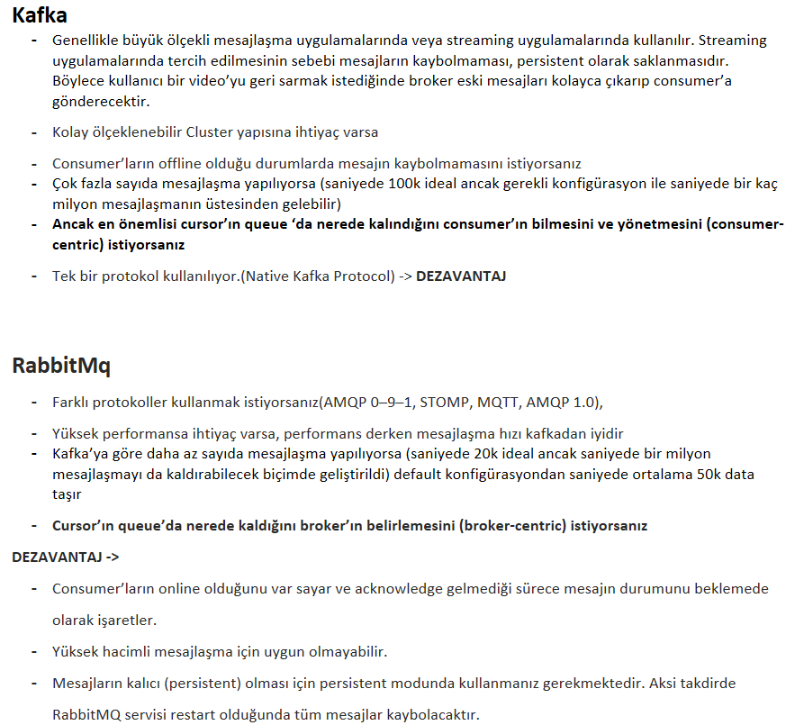

# Mulakat-Sorulari Old

<details>

<summary>Senin sorman gereken sorular ?</summary>

1. Projenin amaci ve kapsami nedir?
2. Projede kullanilan teknolojiler nelerdir?
3. Proje ne zaman basladi ve ne zaman tamamlanmasi bekleniyor?
4. Proje ekibi ne kadar buyuk ve hangi rolleri iceriyordu?
5. Java versiyonu nedir?
6. Spring boot versiyonu nedir?
7. JPA , jdbc ne kullaniyorsunuz?
8. Github, gitlab vb ne kullaniyorsunuz?

</details>

<details>

<summary>Stateful vs stateless nedir?</summary>

Stateful yap?, bir program?n durum bilgisini saklayan ve bu duruma g?re i?lem yapan bir yap?d?r. Stateful yap?lar, ge?mi? i?lemlere ba?l? olarak ?al??an uygulamalar i?in kullan?l?r

ornek/ Bir anne alisveris sepetindeki tum urunleri ve evdeki tum urunleri bilir

Stateless yap? ise, her i?lemi ba??ms?z olarak ele alan ve ?nceki i?lemlerle bir ili?kisi olmayan bir yap?d?r. Stateless yap?lar, her i?lemi ba??ms?z olarak ele alan ve h?zl? yan?t veren uygulamalar i?in tercih edilir.

ornek/ Bir cocuk sadece canin istedigi urunleri alir

</details>

<details>

<summary>JDK ve JRE aras?ndaki farklar nelerdir?</summary>

JRE, Java runtime editioni bir java uygulamas?n? ?al??t?rmak i?in gerekli olan java komponentlerini ve k?t?phanelerini i?eren i?ersinde JVM de kurulu olan programa denir.

JDK, Java ile yaz?l?m geli?tirmek i?in ihtiya? duyulan yaz?l?m kitlerini i?inde bulundurur. .java uzant?l? dosyalar?n compile edilip .class uzant?l? ara dosyalar?n olu?mas?na olanak sa?lar. JDK, i?erisinde JVM,JRE ve Java Compiler'?n? bulundurur.

</details>

<details>

<summary>Super ve this kavramlar? nedir?</summary>

1. **`super`**: Bir alt s?n?fta ?st s?n?f?n metotlar?n? veya de?i?kenlerini kullanmak i?in kullan?lan bir referansd?r. Alt s?n?f?n kendi metotlar?nda, ?st s?n?f?n metotlar?na eri?mek i?in **`super`** anahtar kelimesi kullan?labilir. Ayn? ?ekilde, alt s?n?fta ?st s?n?f?n de?i?kenlerini kullanmak i?in de **`super`** anahtar kelimesi kullan?l?r.
2. **`this`**: Bir s?n?f?n kendi nesnesine eri?mek i?in kullan?lan bir referanst?r. ?zellikle, bir s?n?fta tan?ml? olan de?i?kenlerle ayn? isimli parametrelerin kullan?ld??? durumlarda, **`this`** anahtar kelimesi kullan?larak s?n?f?n kendi de?i?keni ifade edilir.

</details>

<details>

<summary><strong>Object oriented prensipleri nelerdir?</strong></summary>

1. Encapsulation (Kaps?lleme): Verilerin ve i?levlerin bir arada tutulmas? ve gizlenmesi anlam?na gelir. Bu prensip, verilerin ve i?levlerin nesnelerle ilgili oldu?u ve di?er nesneler taraf?ndan do?rudan eri?ilemez oldu?u anlam?na gelir. Bu, g?venli bir kod yazmak i?in ?nemlidir. or/ Araba s?n?f?, verileri (marka, model, renk, h?z vb.) ve fonksiyonlar? (hareket ettirmek, durdurmak, h?z?n? art?rmak veya azaltmak) bir arada tutar ve gizler. Bu ?ekilde, ba?ka s?n?flar?n do?rudan arabayla ilgili verilere veya fonksiyonlara eri?meleri engellenir.
2. Inheritance (Kal?t?m): Bir s?n?f?n ?zelliklerinin, ba?ka bir s?n?fa aktar?lmas? anlam?na gelir. Kal?t?m, kodun yeniden kullan?lmas?na olanak tan?r ve s?n?flar aras?ndaki ili?kileri belirler. Alt s?n?flar, ?st s?n?flar?n ?zelliklerine sahip olabilirler. or/ Araba s?n?f?n?n, bir sedan s?n?f? veya bir SUV s?n?f? gibi alt s?n?flar? olabilir. Bu alt s?n?flar, arabaya ?zg? ?zelliklerin yan? s?ra kendi ?zelliklerine de sahip olabilirler.
3. Polymorphism (?ok bi?imlilik): ?ok bi?imlilik, nesnelerin farkl? bi?imlerde davranabilmesi anlam?na gelir. Ayn? y?ntem ad?, farkl? s?n?flarda farkl? ?ekillerde uygulanabilir. or/ Araba s?n?f?, bir araba hareketi fonksiyonu i?erebilir. Sedan s?n?f? veya SUV s?n?f?, arabay? farkl? ?ekillerde hareket ettirebilir. ?rne?in, sedan araba normal bir ?ekilde hareket edebilirken, SUV araba off-road ko?ullar?na uygun olarak hareket edebilir.
4. Abstraction (Soyutlama): Karma??k bir sistemdeki detaylar?n gizlenmesi anlam?na gelir. Bu prensip, s?n?flar?n aras?ndaki ba??ml?l??? azalt?r ve kodun daha anla??l?r olmas?n? sa?lar. or/ Araba s?n?f?, sadece arabayla ilgili ?zellikleri ve fonksiyonlar? i?erir. Bu, ba?ka s?n?flar?n arabaya ba??ml?l???n? azalt?r ve kodun daha anla??l?r olmas?n? sa?lar.

</details>

<details>

<summary>Method Overloading ve Method Overriding nedir?</summary>

Method Overloading: Ayn? isimli farkl? parametrelerle ayr? ayr? tan?mlanan birden fazla metodun kullan?lmas?d?r. Bu durumda, ayn? isimli farkl? metotlar, farkl? parametreler alarak ayn? s?n?f i?erisinde tan?mlanabilirler. Bu sayede, metot isimleri ayn? kal?r ve farkl? ama?lar i?in kullan?labilirler.

?rne?in:

```java
public class HesapMakinesi {

   public int topla(int sayi1, int sayi2) {
      return sayi1 + sayi2;
   }

   public double topla(double sayi1, double sayi2) {
      return sayi1 + sayi2;
   }

   public int topla(int sayi1, int sayi2, int sayi3) {
      return sayi1 + sayi2 + sayi3;
   }
}

```

Method Overriding: Bir s?n?fta tan?mlanan bir metot, alt s?n?flar taraf?ndan ayn? isim ve parametrelerle yeniden tan?mlan?rsa, bu durumda Method Overriding ger?ekle?ir. Bu sayede, alt s?n?f?n ayn? isimli metodunu ?a??rd???m?zda, ?st s?n?f?n de?il, alt s?n?f?n metodunun ?al??t?r?lmas? sa?lan?r.

?rne?in:

```java
public class Sekil {
   protected double alan;

   public void hesaplaAlan() {
      System.out.println("Alan hesaplan?yor.");
   }
}

```

```java
public class Daire extends Sekil {
   private double yariCap;

   public Daire(double yariCap) {
      this.yariCap = yariCap;
   }

   @Override
   public void hesaplaAlan() {
      alan = Math.PI * yariCap * yariCap;
      System.out.println("Dairenin alan? hesapland?.");
   }
}

```

</details>

<details>

<summary>equals() ve == aras?ndaki fark?</summary>

equals() bir methoddur ve de?i?kenler aras?ndaki de?er kontrol?n? yapar.

\== ifadesi ise de?i?kenlerin referanslar?n? kar??la?t?r?r.

</details>

<details>

<summary>DAO nedir?</summary>

DAO, Data Access Object'?n k?saltmas?d?r. Bu, bir yaz?l?m uygulamas? ile veritaban? aras?ndaki ileti?imden sorumlu olan bir tasar?m desenidir. DAO, uygulaman?n veritaban?na ba??ml?l???n? azaltmak ve uygulama kodunu daha okunakl?, bak?m? kolay ve test edilebilir hale getirmek i?in kullan?l?r.

Dao da crud islemleri yapilir

</details>

<details>

<summary>Dependency injection y?ntemleri nelerdir?</summary>

*   **Dependency injection y?ntemleri nelerdir?**

    Ba??ml?l???n? en aza indirmek i?in kullan?l?r.

   1.  Constructor Injection: Bu y?ntemde, bir bile?enin ba??ml?l?klar?, bile?enin bir yap?land?r?c? metodu kullan?larak enjekte edilir. Bu y?ntem, bir s?n?f?n ba?lat?lmas? i?in gereken t?m ba??ml?l?klar?n a??k?a belirtilmesini sa?lar ve kodun okunakl?l???n? art?r?r.

       ```java

       @Component
       public class MailService implements MessageService {
       private Repository repository;

       @Autowired
       public MailService(Repository repository) {
           this.repository = repository;
       }

       ```
   2.  Setter Injection: Bu y?ntemde, bir bile?enin ba??ml?l?klar?, bile?enin ?zellikleri ?zerinden enjekte edilir. Bu y?ntem, bir bile?enin ba?lat?lmas? s?ras?nda, t?m ba??ml?l?klar?n belirtilmesini gerektirmez. Bunun yerine, bile?enin ?zellikleri ?a?r?larak enjekte edilir.

       ```java
          
       @Component
       public class MailService implements MessageService {
       private Repository repository;

            @Autowired
            public void setRepository(Repository repository) {
        this.repository = repository;

       ```
   3.  Interface Injection: Bu y?ntemde, bir bile?enin ba??ml?l?klar?, bile?enin bir aray?z? kullan?larak enjekte edilir. Bu y?ntemde, bile?enin aray?z?, ba??ml?l?klar? tan?mlar ve bile?enin ba?lat?lmas? s?ras?nda, aray?z? uygulayan bir s?n?f?n enjekte edilmesi gereklidir.

       ```java
          
       @Component
       public class MailService implements IMessageService {

       ```

</details>

<details>

<summary>Abstraction Vs Interface fark?</summary>

Abstraction tum insanlarin kolu ve bacagi olmasi

Interface bazi insanlarin dovmeli bazilarin dovmesiz kollari olmasi gibi

! 1 abstraction olur n tane interface olur

</details>

<details>

<summary>Docker nedir ve ne i?in kullan?l?r?</summary>

Docker, uygulamalar? geli?tirmek, da??tmak ve ?al??t?rmak i?in kullan?lan bir yaz?l?m platformudur. Docker, uygulamalar? bir konteyner i?inde ?al??t?rarak uygulamalar?n yaz?l?m ve donan?m ortamlar?ndan ba??ms?z olarak ?al??mas?n? sa?lar. B?ylece uygulaman?n farkl? ortamlarda sorunsuzca ?al??mas? m?mk?n olur.

</details>

<details>

<summary>@service ve @component arasindaki fark nedir?</summary>

@Component'in bir bile?enin genel anlamda i?aretlenmesi i?in kullan?lmas?, @Service'in ise ?zellikle i? katman? bile?enleri i?in kullan?lmas?d?r.

Ama yaptiklarinda bir fark yok.

**@Service, @Controller, @Repository = {@Component + some more special functionality}**

</details>

<details>

<summary>@controller vs @restcontoller arasindaki fark?</summary>

@RestController, veri d?nd?rmek i?in JSON veya XML format?n? kullanarak HTTP isteklerine yan?t verir, @Controller ise genellikle HTML sayfalar? olu?turmak i?in kullan?l?r.

</details>

<details>

<summary>Normalizasyon Kurallari nelerdir? ve Ornek bir db tasarimi</summary>

Normalizasyon; veri taban? tasar?m a?amas?nda veri tekrar?n?, veri kayb?n? veya veri yetersizli?ini ?nlemek i?in ger?ekle?tirilen i?lemlerdir.

Normalizayon uygulanan veri tabanlar?n?n performans? artar, sabit diskteki boyutu azal?r ve tablolarda ki sat?r ve s?tun say?s? azalaca??ndan veri tekrar? ?nlenmi? olur. ?zellikle silme, g?ncelleme gibi i?lemler de ??kabilecek sorunlar b?y?k oranda azalt?lm?? olur.

*   Normalizasyon Yapilmadan:

    Filmler

    | Film Adi              | Aciklamasi | Yonetmen | Kategori  | Tarih | Oyuncu 1 | Oyuncu 2 |
        | --------------------- | ---------- | -------- | --------- | ----- | -------- | -------- |
    | Yuzuklerin Efendisi 1 | ...        | Peter    | Fantastik | 2001  | Orlando  | Elijah   |
    | Dovus Kulubu          | ...        | David    | Dram      | 1999  | Brad     | Edward   |
*   Normalizasyon Yapilinca:

    Filmler

    | id | Film Adi              | Aciklamasi | Yonetmen | Kategori | Tarih |
        | -- | --------------------- | ---------- | -------- | -------- | ----- |
    | 1  | Yuzuklerin Efendisi 1 | ...        | 1        | 1        | 2001  |
    | 2  | Dovus Kulubu          | ...        | 2        | 2        | 1999  |

    Yonetmenler

    | id | Ad    |
        | -- | ----- |
    | 1  | Peter |
    | 2  | David |

    Kategori

    | id | Ad        |
        | -- | --------- |
    | 1  | Fantastik |
    | 2  | Dram      |

    Oyunucu

    | id | Ad      |
        | -- | ------- |
    | 1  | Orlando |
    | 2  | Elijah  |
    | 3  | Brad    |
    | 4  | Edward  |

    Film Oyunculari

    | Film id | Oyuncu id |
        | ------- | --------- |
    | 1       | 1         |
    | 1       | 2         |
    | 2       | 3         |
    | 2       | 4         |

</details>

<details>

<summary>api nedir ? acilimi nedir</summary>

API'nin a??l?m? olan Application Programming Interface, Uygulama Programlama Arabirimi anlam?na gelir.

Bir yaz?l?m?n ba?ka bir yaz?l?m taraf?ndan kullan?lmas?n? sa?layan bir dizi tan?mlamalar ve protokoller k?mesidir. API'ler, farkl? yaz?l?m sistemleri aras?nda veri al??veri?i yapmay?, i?levsellik sa?lamay? veya ileti?imi kolayla?t?rmay? ama?lar.

Iki programin birbiriyle iletisime gecmesini saglar.

</details>

<details>

<summary>rest api vs soap fark?</summary>

**RESTful**

Bu muhtemelen en yayg?n t?rd?r ve HTML ve JSON gibi standart web protokollerini kullan?r. Kullan?m? kolayd?r ve ba?laman?za yard?mc? olacak ?ok say?da kitapl?k mevcuttur.

**SOAP**

SOAP, Simple Object Access Protocol’? (SOAP) kullan?r ve uygulamalar?n XML mesajlar? kullanarak ileti?im kurmas?n? sa?lar. RESTful kadar yayg?n de?ildir, ancak daha fazla ?zellik ve i?levsellik sunar.

</details>

<details>

<summary>orm nedir?</summary>

ORM (Object-Relational Mapping), ili?kisel veritaban?yla nesne tabanl? programlama aras?ndaki uyumu sa?layan bir yaz?l?m tasar?m? ve programlama tekni?idir. ORM, veritaban? tablolar?n? nesne modele d?n??t?rmeyi ve veritaban? i?lemlerini nesne tabanl? olarak ger?ekle?tirmeyi sa?lar.

</details>

<details>

<summary>jpa nedir?</summary>

JPA (Java Persistence API), Java tabanl? uygulamalarda nesne tabanl? veri eri?imi i?in bir API'dir. JPA, veritaban? i?lemlerini ger?ekle?tirmek i?in ORM (Object-Relational Mapping) prensibine dayan?r. ORM, ili?kisel veritaban? ile nesne tabanl? programlama aras?ndaki uyumu sa?lar ve veritaban? i?lemlerini nesneler ?zerinden yapmay? m?mk?n k?lar.

JPA, veritaban? tablolar?n? Java s?n?flar?yla e?le?tirir ve veritaban? i?lemlerini ger?ekle?tirmek i?in standartle?tirilmi? bir y?ntem seti sunar. Bu sayede, geli?tiriciler veritaban? i?lemlerini SQL sorgular?yla de?il, JPA'n?n sa?lad??? API ile yapabilir. JPA, veri okuma, yazma, g?ncelleme ve silme gibi temel CRUD (Create, Read, Update, Delete) i?lemlerini kolayla?t?r?r ve veritaban? i?lemlerinin daha h?zl? ve daha s?rd?r?lebilir bir ?ekilde ger?ekle?tirilmesini sa?lar.

JPA'n?n pop?ler uygulamalar?ndan biri Hibernate'dir. Hibernate, JPA spesifikasyonunu uygulayan ve JPA tabanl? veri eri?imini sa?layan bir ORM ??z?m?d?r.

Persistence, bilgisayar programlamas?nda verinin kal?c? bir ?ekilde saklanmas? ve eri?ilebilir olmas? anlam?na gelir.

</details>

<details>

<summary>hibernate nedir?</summary>

JPA'n?n pop?ler uygulamalar?ndan biri Hibernate'dir. Hibernate, JPA spesifikasyonunu uygulayan ve JPA tabanl? veri eri?imini sa?layan bir ORM ??z?m?d?r.

</details>

<details>

<summary>JpaRepository, CrudRepository vs PagingeAndSortingRepository fark?</summary>

* CrudRepository sadece Crud i?lemlerini bar?nd?r?r.
* PagingAndSortingRepository sadece s?ralama ve sayfalama fonksiyonlar?n? bar?nd?r?r.
* JpaRepository, CrudRepository ve PagingAndSortingRepository sahip oldu?u t?m fonksiyonlar? bar?nd?r?r.

</details>

<details>

<summary>Solid ilkeleri?</summary>

#### S— Single-responsibility principle

**?ZET**: Single responsibility prensibi s?n?flar?m?z?n iyi tan?mlanm?? tek bir sorumlulu?u olmas? gerekti?ini anlatmaktad?r. Bir s?n?f (nesne) yaln?zca bir ama? u?runa de?i?tirilebilir, o ama?ta o s?n?fa y?klenen sorumluluktur, yani bir s?n?f?n yapmas? gereken yaln?zca bir i?i olmas? gerekir.

or/ Elbise ma?azas? s?n?f?, yaln?zca elbise stoklar?n? takip etmek ve elbise sat??lar?yla ilgilenmekle sorumludur. ?rne?in, elbiselerin stok seviyelerini g?ncellemek, yeni elbise eklemek, elbise sat??lar?n? kaydetmek gibi i?lemleri yapabilir.

#### O— Open-closed principle

**?ZET**: Bir s?n?f ya da fonksiyon halihaz?rda var olan ?zellikleri korumal? ve de?i?ikli?e izin vermemelidir. Yani davran???n? de?i?tirmiyor olmal? ve yeni ?zellikler kazanabiliyor olmal?d?r.

or/ Elbise ma?azas? s?n?f?, yeni elbiselerin eklenmesine a??k olmal?d?r. Yeni bir elbise t?r? eklenmek istendi?inde, mevcut ma?aza s?n?f? de?i?tirilmeden yeni elbise t?r? s?n?f? olu?turularak eklenir.

#### L— Liskov substitution principle

**?ZET**: Kodlar?m?zda herhangi bir de?i?iklik yapmaya gerek duymadan alt s?n?flar?, t?redikleri(?st)(ana) s?n?flar?n yerine kullanabilmeliyiz.

or/ Elbise ma?azas?nda farkl? t?rde elbiseler bulunabilir, ?rne?in elbiseler, g?mlekler, pantolonlar gibi. Bu durumda, her t?r elbisenin kullan?labilirli?i ve davran??lar? ayn? olmal?d?r. Yani, her t?r elbise, ma?aza i?lemlerinde birbirinin yerine ge?ebilmelidir.

#### I— Interface segregation principle

**?ZET**: Sorumluluklar?n hepsini tek bir aray?ze toplamak yerine daha ?zelle?tirilmi? birden fazla aray?z olu?turmal?y?z.

or/ Elbise ma?azas? s?n?f?, m??teriye sat?? yapmak, stok durumunu kontrol etmek ve raporlama gibi i?lemleri ger?ekle?tirebilir. Ancak, t?m bu i?lemler i?in tek bir genel aray?z kullanmak yerine, m??teri sat??lar? i?in ayr? bir aray?z, stok kontrol? i?in ayr? bir aray?z ve raporlama i?in ayr? bir aray?z gibi daha ?zelle?tirilmi? aray?zler olu?turulabilir.

#### D— Dependency Inversion Principle

**?ZET**: S?n?flar aras? ba??ml?l?klar olabildi?ince az olmal?d?r ?zellikle ?st seviye s?n?flar alt seviye s?n?flara ba??ml? olmamal?d?r.

or/ Elbise ma?azas? s?n?f?, do?rudan stok veritaban?na veya sat?? i?lemlerinin ger?ekle?tirildi?i ba?ka bir s?n?fa ba??ml? olmamal?d?r. Bunun yerine, bir aray?z ?zerinden ba??ml?l?k olu?turulabilir ve ilgili i?lemler bu aray?z ?zerinden ger?ekle?tirilebilir. Bu sayede, farkl? veritabanlar? veya sat?? i?lemlerini ger?ekle?tiren farkl? s?n?flar, bu aray?z? uygulayarak kullan?labilir hale gelir.

</details>

<figure><figcaption></figcaption></figure>

<details>

<summary>clean code ?</summary>

1. ?simlendirme:
2. Fonksiyon Boyutu:
3. Tek Sorumluluk ?lkesi:
4. Kod Duplicasyonunun ?nlenmesi:
5. Fonksiyon ve S?n?f Boyutu:
6. Yorum Kullan?m?:
7. Test Edilebilirlik:
8. Bir fonksiyon birden fazla i? yapmamal?

</details>

<details>

<summary>spring bootta katmanli mimari</summary>

1. Veri Eri?im Katman? (Data Access Layer): Veri eri?im katman?, veritaban? veya di?er veri kaynaklar?yla etkile?imde bulunur. Bu katmanda, veritaban?na eri?im sa?lamak i?in JPA (Java Persistence API) veya Spring Data JPA kullan?labilir. Veri eri?im katman?, veri taban?na sorgular? y?r?tme, veri kaydetme/g?ncelleme/silme i?lemlerini ger?ekle?tirme gibi g?revleri yerine getirir.
2. Hizmet Katman? (Service Layer): Hizmet katman?, i? mant???n?n uyguland??? katmand?r. ?? kurallar?n?n uyguland??? i?lemler burada ger?ekle?tirilir. Hizmet katman?, veri eri?im katman?ndan gelen verileri i?leyerek, i? kurallar?na uygun ?ekilde i?lemleri ger?ekle?tirir. Bu katmanda, i?lemler genellikle i? mant???na odaklan?r, veri eri?imi ve veri d?n???m? gibi i?lemler hizmet katman? taraf?ndan y?netilir.
3. Sunum Katman? (Presentation Layer): Sunum katman?, kullan?c? aray?z?n?n bulundu?u katmand?r. Kullan?c? ile etkile?imi sa?layan API'ler, web sayfalar? veya di?er istemci uygulamalar? bu katmanda yer al?r. Sunum katman?, gelen istekleri al?r, hizmet katman? arac?l???yla i?lemleri ger?ekle?tirir ve sonu?lar? kullan?c?ya sunar.

* Sunum/Presentation i?in MVC - @Controller
* ??/business i?in Service -@Service
* Veri eri?im/data access i?in Repository - @Repository

</details>

<details>

<summary>JPA (Java Persistence API) ve JPA Repository, Spring Framework ile birlikte kullan?lan veritaban? eri?im teknolojileridir. ?kisi aras?ndaki fark?</summary>

?zet olarak, JPA Java tabanl? uygulamalarda veritaban? eri?imi sa?layan bir spesifikasyonken, JPA Repository ise Spring Data JPA taraf?ndan sunulan ve JPA teknolojisini kullanarak veritaban? i?lemlerini kolayla?t?ran bir bile?endir. JPA Repository, CRUD i?lemlerini otomatik olarak sa?lar ve ?zel sorgular?n tan?mlanmas?n? kolayla?t?r?r.

</details>

<details>

<summary>Public, Private, Default and Protected ?</summary>

* `public`: Her yerden eri?ilebilir.
* `private`: Sadece ait oldu?u s?n?f i?inden eri?ilebilir.
* `default` (package-private): Ayn? paketten eri?ilebilir, farkl? paketlerden eri?ilemez.
* `protected`: Ait oldu?u s?n?f?n alt s?n?flar? ve ayn? paket i?indeki s?n?flardan eri?ilebilir.

</details>

<details>

<summary>Spring ve Spring Boot aras?ndaki farklar ?</summary>

1. Proje Ba?latma ve Yap?land?rma: Spring, geli?tiricilerin daha fazla yap?land?rma se?ene?i sunarken, Spring Boot, otomatik yap?land?rmay? ve varsay?lan ayarlar? kullanarak projenin h?zl? bir ?ekilde ba?lat?lmas?n? sa?lar.
2. Ba??ml?l?klar ve Konfig?rasyon: Spring, projenin ba??ml?l?klar?n? ve yap?land?rmas?n? geli?tiricinin belirlemesine olanak tan?rken, Spring Boot, ba??ml?l?klar? ve yap?land?rmay? otomatik olarak y?netir. Bu sayede, geli?tirici daha az ayar yaparak projeyi h?zl? bir ?ekilde ba?latabilir.
3. Standartla?t?rma: Spring, esneklik ve ?zelle?tirme se?enekleri sunarken, Spring Boot, standart yap?land?rma ve proje yap?s? sunarak projelerin h?zl? bir ?ekilde geli?tirilmesini sa?lar. Spring Boot, konvansiyonlar? takip eden bir yap?ya sahiptir ve "opinionated" (belirli bir yakla??m? tercih eden) bir yakla??m sergiler.
4. Geli?tirme Deneyimi: Spring Boot, otomatik yap?land?rma ve dahili sunucu gibi ?zellikleriyle geli?tirme s?recini kolayla?t?r?r. Ayr?ca, Spring Boot, aktif geli?tirme toplulu?u ve haz?r ?rnek projeleri sayesinde ba?lang?? seviyesi ve h?zl? prototip olu?turma i?in pop?ler bir se?enektir.

Sonu? olarak, Spring ve Spring Boot, Java tabanl? uygulamalar?n geli?tirilmesinde kullan?lan framework'lerdir. Spring, esneklik ve ?zelle?tirme se?enekleri sunarken, Spring Boot ise h?zl? ba?latma, otomatik yap?land?rma ve standartla?t?rma gibi ?zellikleriyle projelerin h?zl? bir ?ekilde geli?tirilmesini sa?lar. Spring

</details>

<details>

<summary>Spring AOP?</summary>

Aspect-oriented programming (AOP) Faydalar?:

* Daha temiz bir kod olu?ur
* Kodlar? okumak kolayla??r
* S?rd?r?lmesi daha kolayd?r
* Kod tekrar?ndan ka??n?r
* Kodlar? test etmek daha kolay
* Geli?tirme yapmay? h?zland?r?r

</details>

<details>

<summary>Web socket nedir ? ne i?in kullan?l?r ?</summary>

WebSocket: Bu y?ntem, web sayfas?ndaki bir taray?c? ve bir ba?ka yap? aras?nda bir ba?lant? kurar ve bu ba?lant? sayesinde taray?c? anl?k olarak bilgi alarak ekran? g?ncellemesini sa?lar. B?ylece, web sayfas?n?n yenilenmesine gerek kalmadan ekran anl?k olarak g?ncellenebilir.

</details>

<details>

<summary>Java'da Set ve Map veri yap?lar?n?n ArrayList ile fark?</summary>

1. Veri S?ralamas?: **`ArrayList`**, verileri eklenme s?ras?na g?re saklar ve tekrarl? elemanlara izin verirken, **`Set`** verileri s?ras?z bir ?ekilde saklar ve tekrarl? elemanlara izin vermez. **`Map`** ise anahtar-de?er ?iftlerini saklar ve her anahtar?n yaln?zca bir kez bulunmas?na izin verir.
2. Eleman Eri?imi: **`ArrayList`**, indeks numaralar? kullan?larak elemanlara eri?imi destekler. **`Set`** ve **`Map`** ise elemanlara anahtar de?erleriyle eri?imi destekler. Her bir eleman?n benzersiz bir anahtar? oldu?u i?in, h?zl? eri?im sa?larlar.
3. Tekrarl? Elemanlar: **`ArrayList`** ayn? eleman?n birden fazla kez bulunmas?na izin verirken, **`Set`** ve **`Map`** her eleman?n yaln?zca bir kez bulunmas?na izin verir.
4. Performans: Eleman ekleme ve silme i?lemlerinde **`ArrayList`** daha h?zl?d?r, ??nk? elemanlar?n s?ras?n? korumak i?in fazladan bir maliyeti yoktur. Ancak, elemanlara eri?imde **`Set`** ve **`Map`** daha h?zl?d?r ??nk? anahtar de?erlerini kullanarak do?rudan elemanlara eri?ebilirler.

</details>

<details>

<summary>ArrayList and a LinkedList arasindaki fark?</summary>

**`ArrayList`** indeks tabanl? eri?im ve s?ral? veri depolama i?in daha uygundurken, **`LinkedList`** dinamik ekleme ve silme i?lemleri i?in daha uygundur.

</details>

<details>

<summary>Stack ve Heap memory Aras?ndaki Fark Nedir?</summary>

E?er program esnas?nda boyutlar? bildirilmi? de?i?mez bir de?er kullan?yorsak _stack_, de?i?ebilir bir de?er kullan?yorsak _heap_ bizim i?in uygun olacakt?r. _Stack_ ve _heap_ kullan?mlar? farkl? ve dikkat edilmesi gereken bir konudur. _Stack_ kullan?l?r ve i?i bittikten sonra kendini otomatik olarak bellekten yok eder. Fakat _heap_‘te bu i?i siz yapmal?s?n?z.

Genel olarak, stack haf?zas? genellikle yerel de?i?kenler, metod ?a?r?lar?, i?aret?iler gibi program?n ?al??ma zaman?nda dinamik olarak de?i?meyen verileri depolamak i?in kullan?l?rken, heap haf?zas? daha b?y?k ve dinamik olarak de?i?en veri yap?lar?n?, nesneleri ve veri yap?s? ?rneklerini depolamak i?in kullan?l?r.

</details>

<details>

<summary>Mutable ve Immutable nedir ?</summary>

Immutable (degismez), nesneler bir kez olusturulduktan sonra icerigi degistirilemeyen siniflardir. Tam tersi olarak, degistirilebilen siniflar da Mutable (degisebilir) siniflardir. Kisacasi Immutable nesneler degismeyen nesnelerdir. Onlari olusturursun, fakat onlari degistiremezsin.

Java'da immutability ornegi String sinifidir. String nesneleri bir kez olusturulduktan sonra degistirilemez. Eger bir String nesnesini degistirirseniz, aslinda yeni bir String nesnesi olusturulur.

Immutabilite avantajlari sunlar olabilir:

1. **Thread Guvenligi:** Degismez nesnelerin thread guvenligi daha yuksektir, cunku bir kez olusturulduktan sonra durumu degistirilemedigi icin senkronizasyon sorunlari ortaya cikmaz.
2. **Cacheleme Kolayligi:** Degismez nesneler cacheleme (onbellege alma) icin uygundur, cunku bir kere olusturulduktan sonra degerleri degismedigi icin cacheleme islemleri daha etkili olabilir.
3. **Debug Kolayligi:** Degismez nesnelerin degerleri degismedigi icin programin durumu daha ongorulebilir ve hata ayiklama daha kolay olabilir.
4. **Referans Stabilitesi:** Degismez nesnelerin referanslari degismedigi icin bir nesnenin referansi uzerinde calisan diger kodlar icin beklenmeyen durumlar ortaya cikmaz.

Bu nedenlerden dolayi, ozellikle coklu is parcacigi iceren ortamlarda veya guvenilir, tahmin edilebilir kod yazma ihtiyaci olan yerlerde immutabilite prensibi tercih edilebilir.

</details>

<details>

<summary>Multithreading nedir ?</summary>

Multithreading'in avantajlar?:

1. Performans Art???: Multithreading, i? par?ac?klar?n? e?zamanl? olarak ?al??t?rarak program?n daha h?zl? ?al??mas?n? sa?lar.
2. Paralel ??lemler: Birden fazla i? par?ac??? sayesinde farkl? g?revler ayn? anda y?r?t?lebilir, bu da paralelizmi sa?lar.
3. Daha iyi Yan?t S?resi: Multithreading, kullan?c? giri?lerine daha h?zl? yan?t verir ve daha duyarl? bir kullan?c? deneyimi sa?lar.
4. Kaynak Verimlili?i: ?? par?ac?klar?n?n ?ekirdekler aras?nda da??t?lmas?, i?lemci kaynaklar?n?n daha verimli kullan?lmas?n? sa?lar.
5. ?leti?im ve Payla??m: ?? par?ac?klar? aras?nda bilgi ve veri payla??m? yapabilir, ileti?im kurabilirsiniz.

Multithreading'in dezavantajlar?:

1. Yar?? Ko?ullar?: Birden fazla i? par?ac??? ayn? kayna?? de?i?tiriyorsa, yar?? ko?ullar? ve veri uyumlulu?u sorunlar? ortaya ??kabilir.
2. Senkronizasyon Zorluklar?: ?? par?ac?klar? aras?nda senkronizasyon gerekti?inde, senkronizasyon mekanizmalar?n? do?ru ?ekilde kullanmak karma??k olabilir.
3. Hata Ay?klama: Multithreading hatalar? genellikle daha zor tespit edilebilir ve hata ay?klama s?reci daha karma??k olabilir.
4. Kaynak T?ketimi: Birden fazla i? par?ac???, i?lemci ve bellek kaynaklar?n? daha yo?un bir ?ekilde kullan?r. Gereksiz i? par?ac??? olu?turma veya verimsiz kodlamalar performans sorunlar?na neden olabilir.
5. Karma??kl?k: Multithreading, program?n karma??kl???n? art?rabilir. ?? par?ac?klar?n?n do?ru bir ?ekilde senkronize edilmesi ve y?netilmesi gereklidir.

Sonu? olarak, multithreading'in avantajlar? aras?nda performans art???, paralel i?lemler, daha iyi yan?t s?resi ve kaynak verimlili?i bulunurken, yar?? ko?ullar?, senkronizasyon zorluklar?, hata ay?klama zorluklar? ve kaynak t?ketimi gibi dezavantajlar? da vard?r. Do?ru bir ?ekilde kullan?ld???nda multithreading, verimli ve h?zl? ?al??an uygulamalar?n geli?tirilmesini sa?lar.

</details>

<details>

<summary>Spring IOC nedir?</summary>

Spring IOC (Inversion of Control), Spring Framework'?n temel bir prensibidir ve bir tasar?m desenidir. IOC, bir bile?enin (bean) olu?turulmas?, yap?land?r?lmas? ve y?netilmesi s?recinin kontrol?n? programc?dan alarak, bu g?revi Spring Framework'e devretmeyi sa?lar.

IOC'nin temel felsefesi, ba??ml?l?klar?n tersine ?evrilmesidir. Geleneksel olarak, bir bile?en di?er bile?enlerle do?rudan ili?kilerini kurar ve bunlar? olu?turur veya y?netir. Ancak, IOC ile bile?enlerin ba??ml?l?klar? tersine ?evrilir ve Spring konteyneri taraf?ndan y?netilen bir IOC konteyneri kullan?l?r.

Spring IOC, a?a??daki ?ekillerde sa?lad??? avantajlara sahiptir:

1. Ba??ml?l?klar?n Y?netimi: IOC sayesinde, bile?enlerin ba??ml?l?klar?n? y?netmek kolayla??r. Bile?enler, Spring konteynerine tan?mlan?r ve ba??ml?l?klar? otomatik olarak ??z?l?r.
2. Gev?ek Ba?l?l?k(Loosely coupled?): IOC, bile?enler aras?ndaki ba??ml?l??? gev?ek hale getirir. Bile?enler, aralar?nda s?k? ba?lant?lar olu?turmak yerine, Spring konteyneri taraf?ndan y?netilen aray?zler veya s?zle?meler ?zerinden etkile?imde bulunurlar.
3. Test Edilebilirlik: IOC, ba??ml?l?klar? enjekte etme mekanizmas? sunar, bu da bile?enlerin daha kolay test edilmesini sa?lar. Ba??ml?l?klar?n taklitleri (mocks) kullan?larak bile?enlerin test edilmesi daha kolay hale gelir.
4. Mod?lerlik: IOC, bile?enlerin ba??ms?z olarak geli?tirilmesini ve yeniden kullan?lmas?n? sa?lar. Bile?enlerin i?levselli?i birbirinden ba??ms?z olarak geli?tirilebilir ve daha sonra IOC konteyneri taraf?ndan birle?tirilir.

Inversion of control;

* Strategy Pattern
* Service Lacator Pattern
* Factory Pattern
* Dependency Injection

gibi mekanizmalarla uygulanabilir.

</details>

<details>

<summary>Spring Bean nedir?</summary>

Spring Bean, Spring Framework taraf?ndan y?netilen ve IOC konteyneri taraf?ndan olu?turulan, y?netilen ve yap?land?r?lan bir nesnedir. Bean'ler, Spring uygulamalar?nda kullan?lan temel yap? ta?lar?d?r ve Spring konteyneri taraf?ndan olu?turulurlar ve y?netilirler.

Spring Bean'lerin temel ?zellikleri ?unlard?r:

1. Ya?am D?ng?s? Y?netimi: Spring Bean'ler, IOC konteyneri taraf?ndan y?netilen bir ya?am d?ng?s?ne sahiptir. Konteyner, bean'in olu?turulmas?, yap?land?r?lmas?, kullan?lmas? ve sonland?r?lmas? gibi ad?mlar? otomatik olarak ger?ekle?tirir.
2. Ba??ml?l?klar?n Otomatik ??z?lmesi: Bean'ler aras?ndaki ba??ml?l?klar, IOC konteyneri taraf?ndan otomatik olarak ??z?l?r. Ba??ml? bean'ler, uygun ?ekilde enjekte edilir veya referanslar? ??z?l?r.
3. Yap?land?rma ve Ayarlanabilirlik: Bean'ler, Spring konteynerine yap?land?rma metadatalar? ile tan?mlan?r. Bu metadatalar, XML veya Java tabanl? konfig?rasyon dosyalar?, Java Annotation'lar? veya Spring Boot gibi modern ara?lar arac?l???yla sa?lanabilir. Bu sayede bean'lerin ?zellikleri, ba??ml?l?klar? ve davran??lar? kolayca ayarlanabilir.
4. ?l?eklenebilirlik ve Mod?lerlik: Spring Bean'ler, uygulamalar?n ?l?eklenmesi ve mod?ler bir yap?ya sahip olmas? i?in kullan??l?d?r. Bile?enlerin ayr? ayr? geli?tirilebilmesi ve ard?ndan IOC konteyneri taraf?ndan birle?tirilmesi sa?lan?r.

Spring Bean'ler, Spring Framework'?n sundu?u ?e?itli ?zelliklerden yararlanabilirler. ?rne?in, AOP (Aspect-Oriented Programming) ile g?venlik, transaksiyon y?netimi, ?nbellekleme gibi ilave i?levselli?i uygulamak m?mk?nd?r.

Spring Bean'leri, IOC konteynerine tan?mlanan bir isim veya tip arac?l???yla elde edebilir ve uygulaman?n farkl? b?lgelerinde kullanabilirsiniz. Bu sayede bean'lerin olu?turulmas? ve y?netimi Spring taraf?ndan otomatik olarak ger?ekle?tirilirken, programc?lar bean'lerin i?levselli?i ?zerinde odaklanabilir ve kolayca uygulama geli?tirebilir.

</details>

<details>

<summary>Java'da static ve final nedir ve nerelerde kullan?l?yor. ?rnek verebilir misin?</summary>


static`ve`final\` anahtar kelimeleri, Java programlama dilinde farkl? ama?lar i?in kullan?lan ?nemli kavramlard?r.

1.  `static` Anahtar Kelimesi:

   * `static` anahtar kelimesi, bir de?i?kenin veya metotun s?n?fa ait oldu?unu belirtmek i?in kullan?l?r. Bu, o de?i?kenin veya metotun s?n?f?n herhangi bir ?rne?i olmadan kullan?labilece?i anlam?na gelir.
   * `static` de?i?kenler, s?n?fa ait olan de?i?kenlerdir ve her bir ?rne?i taraf?ndan payla??l?rlar. De?i?kenin son de?eri, t?m ?rnekler aras?nda ayn?d?r.
   * `static` metotlar, s?n?fa ait olan metotlard?r ve s?n?f ad?yla do?rudan ?a?r?labilirler. Bunlar ?rneklerle ili?kili olmad???ndan, s?n?f?n durumunu de?i?tiremezler.&#x20;
   * ?rnek:

    ```java
     class MyClass {
           static int count; // Statik bir de?i?ken

           public MyClass() {
               count++; // Her bir ?rne?in olu?turulmas?yla count de?eri artar
           }

           public static void printMessage() {
               System.out.println("Statik metot");
           }
       }
       
       MyClass obj1 = new MyClass();
       MyClass obj2 = new MyClass();
       System.out.println(MyClass.count); // ??kt?: 2
       MyClass.printMessage(); // ??kt?: Statik metot
    ```


2.  `final` Anahtar Kelimesi:

   * `final` anahtar kelimesi, bir de?i?kenin, metotun veya s?n?f?n de?i?tirilemez oldu?unu belirtmek i?in kullan?l?r.
   * `final` de?i?kenler, bir kez de?er atand?ktan sonra de?i?tirilemezler. Sabit de?erlere sahip de?i?kenlerdir.
   * `final` metotlar, alt s?n?flar taraf?ndan ezilemezler. Yani, bu metotlar alt s?n?flar taraf?ndan de?i?tirilemez veya yeniden uygulanamaz.
   * `final` s?n?flar, alt s?n?flara sahip olamazlar. Yani, ba?ka bir s?n?f bir `final` s?n?f?ndan t?retilemez.&#x20;
   * Final degiskenler, class'larda ve methodlarda kullanilabilir.
   * ?rnek:

    ```java
    final int MAX_VALUE = 100;
       // MAX_VALUE de?eri bir kez atand?ktan sonra de?i?tirilemez

       class BaseClass {
           public final void printMessage() {
               System.out.println("BaseClass'ten mesaj");
           }
       }

       class DerivedClass extends BaseClass {
           // Hata verecektir: "Cannot override the final method from BaseClass"
           public void printMessage() {
               System.out.println("DerivedClass'ten mesaj");
           }
       }

       final class FinalClass {
           // ...
       }

       // Hata verecektir: "Cannot inherit from final FinalClass"
       class DerivedClass extends FinalClass {
           // ...
       }
       
    ```

</details>

<details>

<summary>@ComponentScan, @Component, @Bean, @Repository, @Service, @Controller ve @RestController annotation neden kullan?yoruz?</summary>

Java Spring framework'?, uygulama geli?tirme s?recini kolayla?t?ran ve d?zenleyen bir dizi annotasyon (i?aretleyici) sa?lar. ??te bu annotasyonlardan baz?lar?n?n kullan?m amac?:

1. `@ComponentScan`: Bu annotasyon, Spring uygulamas?n?n bile?enlerini (component) taramak i?in kullan?l?r. Belirtilen paket veya paketlerdeki s?n?flar? tarayarak, Spring taraf?ndan y?netilen bean'leri bulur ve otomatik olarak yarat?r.
2. `@Component`: Bu annotasyon, bir s?n?f?n bir Spring bile?eni oldu?unu belirtmek i?in kullan?l?r. Spring, bu annotasyonu g?rd???nde ilgili s?n?f? bir bean olarak y?netir ve Spring uygulamas? i?inde kullan?labilir hale getirir.
3. `@Bean`: Bu annotasyon, bir metodu Spring taraf?ndan y?netilen bir bean olarak kaydetmek i?in kullan?l?r. Genellikle yap?land?rma s?n?flar?nda veya @Configuration annotasyonu ile i?aretlenmi? s?n?flarda kullan?l?r. Bu ?ekilde, ilgili metot taraf?ndan d?n?len nesne Spring konteynerine dahil edilir ve uygulama i?inde kullan?labilir hale gelir.
4. `@Repository`: Bu annotasyon, veri eri?im katman? (data access layer) s?n?flar?n? belirtmek i?in kullan?l?r. Bir veritaban?na eri?mek, sorgular? y?r?tmek veya veri i?leme i?lemlerini ger?ekle?tirmek gibi veri taban? i?lemleriyle ilgili s?n?flar? i?aretlemek i?in kullan?l?r.
5. `@Service`: Bu annotasyon, i? mant??? katman? (business logic layer) s?n?flar?n? belirtmek i?in kullan?l?r. Uygulama i? mant???n? uygulayan servis s?n?flar?n? ifade eder. Veri i?leme, hesaplamalar, d?? hizmetlere eri?im vb. gibi i?lemleri ger?ekle?tirmek i?in kullan?labilir.
6. `@Controller`: Bu annotasyon, Spring MVC (Model-View-Controller) tabanl? web uygulamalar?nda kullan?lan kontrol s?n?flar?n? belirtmek i?in kullan?l?r. ?stemci taleplerini kar??lamak, i?lemek ve uygun bir yan?t d?nd?rmek i?in kullan?l?r.
7. `@RestController`: Bu annotasyon, RESTful web hizmetleri sunmak i?in kullan?lan kontrol s?n?flar?n? belirtmek i?in kullan?l?r. Hem `@Controller` hem de `@ResponseBody` annotasyonlar?n?n birle?imidir. Bu sayede, ilgili s?n?f?n t?m y?ntemleri JSON veya XML gibi veri formatlar?nda yan?tlar ?retir.

Bu annotasyonlar, Spring framework'? i?inde uygulama bile?enlerini belirtmek ve yap?land?rmak i?in kullan?l?r. Bu sayede Spring, otomatik olarak s?n?flar? y?netir, ba??ml?l?klar? ??zer ve uygulaman?n d?zg?n ?al??mas?n? sa?lar. Her annotasyonun kendine ?zg? bir amac? ve kullan?m senaryosu vard?r ve projenin ihtiya?lar?na g?re do?ru bir ?ekilde kullan?lmas? ?nemlidir.

</details>

<details>

<summary>HashMap'?n ?al??ma mant???n? anlat?rm?s?n. Neden equal ve hashCode methodlar?n? kullanmal?y?z?</summary>

1. `HashMap`'in ?al??ma Mant???:
   * `HashMap`, bir anahtar-de?er ikilileri koleksiyonudur. Her bir anahtar, benzersiz olmal?d?r ve de?erlere kar??l?k gelir.
   * `HashMap`, anahtarlar?n hash de?erlerine dayanarak verileri h?zl? bir ?ekilde depolar ve eri?ir.
   * Bir anahtar?n hash de?eri, `hashCode()` metodunu kullanarak hesaplan?r. Bu hash de?eri, `HashMap` i?indeki bir h?creye (bucket) kar??l?k gelir.
   * E?le?en anahtarlar ayn? h?creye atanabilir. Bu durumda, bu h?crede bir zincir (linked list) olu?ur.
   * `HashMap`, `equals()` metodu arac?l???yla anahtarlar?n e?itli?ini kontrol eder. E?it olan anahtarlar ayn? h?crede ayn? zincirde bulunur.
   * Bir de?ere eri?mek istedi?imizde, ilgili anahtar?n hash de?eri kullan?larak hedef h?creye ula??l?r ve zincirde gezinilir.
2. `equals()` ve `hashCode()` Metodlar?n?n ?nemi:
   * `equals()` metodu, iki nesnenin i?eriklerinin e?it olup olmad???n? kontrol eder. `HashMap` i?inde anahtarlar? kar??la?t?rmak i?in kullan?l?r.
   * `hashCode()` metodu, bir nesnenin benzersiz bir hash de?erini d?nd?r?r. Bu de?er, `HashMap` i?indeki h?creye yerle?tirme ve eri?imde kullan?l?r.
   * `HashMap`, iki anahtar?n e?it oldu?unu belirlemek i?in `equals()` metodunu kullan?r. E?er `equals()` metodu do?ru bir ?ekilde uygulanmazsa, ayn? anahtar?n farkl? hash de?erleri olabilir ve bu da beklenmeyen sonu?lara yol a?abilir.
   * `hashCode()` metodunun do?ru bir ?ekilde uygulanmas?, ayn? nesnelerin her zaman ayn? hash de?erine sahip olmas?n? sa?lar. Bu, ayn? anahtar?n ayn? h?creye atanmas?n? ve do?ru de?erin elde edilmesini sa?lar.
   * `equals()` ve `hashCode()` metodlar?n?n birlikte kullan?lmas?, `HashMap` i?inde anahtarlar?n do?ru ?ekilde ?al??mas?n? sa?lar. E?er bir anahtar?n `equals()` metodunu ge?ersiz k?larsan?z, ayn? anahtar?n `hashCode()` metodunu da ge?ersiz k?lman?z gerekir.

`equals()` ve `hashCode()` metodlar?n?n do?ru bir ?ekilde uygulanmas?, `HashMap`'in anahtarlar?n? g?venilir ve etkin bir ?ekilde i?lemesini sa?lar. Bu nedenle, `HashMap` veya benzeri veri yap?lar?nda anahtar olarak kullan?lan s?n?flar?n bu metodlar? d?zg?n bir ?ekilde uygulamalar? ?nemlidir. Aksi takdirde, beklenmeyen sonu?lara ve hatal? veri eri?imine neden olabilir.

</details>

<details>

<summary>Hibernate'de Fetch typelar nelerdir? A??klayabilir misin?</summary>

Hibernate, Java tabanl? bir ORM (Object-Relational Mapping) ?er?evesidir ve veritaban? i?lemlerini kolayla?t?r?r. Fetch t?rleri, Hibernate'de nesne ili?kileri ve ili?kili verilerin nas?l al?naca??n? belirtmek i?in kullan?lan kavramlard?r. ??te Hibernate'de kullan?lan fetch t?rlerinin a??klamalar?:

1. `FetchType.LAZY`:
   * Bu fetch t?r?, ili?kili verilerin gerekti?inde yani kullan?ld???nda y?klenmesini sa?lar.
   * ?li?kili veriler, ilgili nesneye eri?ilmeye ?al???ld???nda veya verilerin ?a?r?lmas? gerekti?inde y?klenir.
   * Bu, performans a??s?ndan faydal? olabilir ??nk? ili?kili veriler yaln?zca ihtiya? duyuldu?unda getirilir ve gereksiz y?klenme ?nlenebilir.
2. `FetchType.EAGER`:
   * Bu fetch t?r?, ili?kili verilerin ana nesne y?klenirken hemen y?klenmesini sa?lar.
   * ?li?kili veriler, ana nesnenin y?klendi?i a?amada otomatik olarak getirilir.
   * ?htiya? duyulmasa bile t?m ili?kili veriler y?klenir, bu nedenle b?y?k veri k?mesi veya performans endi?eleri olu?abilir.
3. `FetchType.DEFAULT`:
   * Bu fetch t?r?, belirli bir fetch t?r? belirtilmedi?inde varsay?lan olarak kullan?l?r.
   * Genellikle `FetchType.LAZY` ile ayn?d?r, yani ili?kili veriler gerekti?inde y?klenir.

Fetch t?rleri, Hibernate'in ili?kili nesneleri veritaban?ndan nas?l getirece?ini belirler. `LAZY` fetch t?r?, veri eri?imini daha tembel bir ?ekilde yapar ve performans? art?rabilirken, `EAGER` fetch t?r?, ili?kili verileri hemen getirerek veritaban? eri?imlerini art?rabilir. Se?ilecek olan fetch t?r?, uygulaman?n ihtiya?lar?na ve performans gereksinimlerine ba?l?d?r.

Fetch t?rleri, genellikle Hibernate'de ili?kili nesneler aras?nda `@OneToMany`, `@OneToOne`, `@ManyToMany` gibi ili?ki annotasyonlar? kullan?ld???nda belirtilir. Bu annotasyonlar ?zerinde `fetch` parametresi kullan?larak fetch t?r? belirtilebilir.

?rne?in:

```java
@Entity
public class Order {
    // ...
    @OneToMany(fetch = FetchType.LAZY)
    private List<OrderItem> items;
    // ...
}
```

Bu ?rnek, `Order` s?n?f?nda `OrderItem` ile `@OneToMany` ili?kisinin oldu?unu ve ili?kili verilerin `LAZY` fetch t?r?yle y?klenece?ini belirtir.

</details>

<details>

<summary>Hibernate “Lazy Initialization Exception” Nedir?</summary>

    https://medium.com/@metinalniacik/hibernate-lazy-initialization-exception-hatas%C4%B1-ve-onun-%C3%A7%C3%B6z%C3%BCm%C3%BC-38515c4f98d0

Hibernate "LazyInitializationException", Hibernate'in tembel yukleme (lazy loading) stratejisini kullandigi durumlarda ortaya cikan bir istisnadir. Tembel yukleme, bir iliskilendirilmis nesnenin (ornegin, bir koleksiyon veya baska bir iliskili varlik) sadece kullanildigi zaman yuklenmesini saglayan bir stratejidir. Bu, performansi artirmak ve gereksiz veritabani sorgularini onlemek icin kullanilir.

Ancak, eger Hibernate bir nesnenin tembel yuklenmesini gerceklestirirken ilgili Hibernate oturumu (session) kapandiysa veya nesne oturum disinda kullanilmaya calisiliyorsa, "LazyInitializationException" ortaya cikar. Bu durumda, Hibernate tembel yuklenen nesneyi almak icin gerekli olan veritabani sorgularini gerceklestiremez cunku oturum kapalidir.

Bu durumu anlamak icin su ornek dusunulebilir:

```java
@Entity
public class Author {
    @Id
    @GeneratedValue(strategy = GenerationType.IDENTITY)
    private Long id;

    private String name;

    @OneToMany(mappedBy = "author", fetch = FetchType.LAZY)
    private List<Book> books;

    // getter ve setter metotlari
}

@Entity
public class Book {
    @Id
    @GeneratedValue(strategy = GenerationType.IDENTITY)
    private Long id;

    private String title;

    @ManyToOne(fetch = FetchType.LAZY)
    @JoinColumn(name = "author_id")
    private Author author;

    // getter ve setter metotlari
}
```

Yukaridaki ornekte, `Author` sinifinda `books` adinda tembel yuklenen bir koleksiyon bulunmaktadir. Eger bir `Author` nesnesi yaratilip Hibernate oturumu kapandiktan sonra, bu nesnenin tembel yuklenen koleksiyonu olan `books`'a erisilmeye calisilirsa, "LazyInitializationException" alinabilir:

```java
// Hibernate oturumu acilir
Session session = sessionFactory.openSession();
Transaction tx = session.beginTransaction();

Author author = session.get(Author.class, 1L);

// Hibernate oturumu kapatilir
session.close();

// Asagidaki satir "LazyInitializationException" hatasina neden olabilir
List<Book> books = author.getBooks();
```

Bu hatayi onlemek icin birkac yaklasim vardir:

1. **Eager Loading (Ileri Yukleme):** Iliskili nesneleri oturum icinde aninda yukleyerek bu hatayi onleyebilirsiniz. Ancak bu, performans sorunlarina yol acabilir cunku tum iliskili nesneleri her zaman yuklemeniz gerekebilir.

    ```java
    @ManyToOne(fetch = FetchType.EAGER)
    ```

2. **Oturum Acikken Calisma (Open Session in View):** Hibernate oturumunun bir HTTP istegi boyunca acik kalmasini saglayarak bu hatayi cozebilirsiniz. Ancak, bu yontem bazi durumlarda guvenlik ve performans sorunlarina neden olabilir.

3. **DTO (Data Transfer Object) Kullanma:** Iliskili nesneleri yuklemek yerine sadece gerekli verileri iceren bir DTO kullanabilirsiniz.

4. **Hibernate.initialize() Metodu:** Iliskili nesneleri elle yuklemek icin Hibernate'in `initialize()` metodunu kullanabilirsiniz.

    ```java
    Hibernate.initialize(entity.getRelatedObject());
    ```

Hangi yontemin kullanilacagi uygulamanin ihtiyaclarina ve gereksinimlerine baglidir.

</details>


<details>

<summary>Hibernate N+1 problemi nedir ?</summary>

Hibernate N+1 problemi, bir ORM (Object-Relational Mapping) arac? olan Hibernate'in performansla ilgili bir sorunudur. Bu problem, ili?kisel veritaban? tablolar? aras?ndaki ili?kilerin getirilmesi s?ras?nda ortaya ??kar ve genellikle birle?tirilmi? sorgu (join fetch) veya entity graph kullan?lmad???nda meydana gelir.

N+1 problemi ?u ?ekilde ?zetlenebilir: Bir ana nesne (?rne?in, bir Entity s?n?f?) al?nd???nda, bu ana nesnenin ili?kili oldu?u di?er nesneler ayr? ayr? sorgularla ?ekilir. Bu durumda, birinci sorgu ana nesneyi getirirken, N adet ek sorgu, bu ana nesnenin ili?kili oldu?u di?er nesneleri getirir. Bu durumu bir ?rnek ?zerinden a??klayal?m.

```java
@Entity
public class Author {
    @Id
    @GeneratedValue(strategy = GenerationType.IDENTITY)
    private Long id;

    private String name;

    @OneToMany(mappedBy = "author", fetch = FetchType.LAZY)
    private List<Book> books;

    // Getter ve Setter metotlar?
}

@Entity
public class Book {
    @Id
    @GeneratedValue(strategy = GenerationType.IDENTITY)
    private Long id;

    private String title;

    @ManyToOne
    @JoinColumn(name = "author_id")
    private Author author;

    // Getter ve Setter metotlar?
}
```

Yukar?daki ?rnekte, `Author` s?n?f? ile `Book` s?n?f? aras?nda One-to-Many ili?kisi bulunmaktad?r. Bir yazar?n t?m kitaplar?n? getirmek i?in ?u ?ekilde bir sorgu yap?labilir:

```java
List<Author> authors = entityManager.createQuery("SELECT a FROM Author a", Author.class).getResultList();

for (Author author : authors) {
    System.out.println("Author: " + author.getName());
    
    for (Book book : author.getBooks()) {
        System.out.println("Book: " + book.getTitle());
    }
}
```

Bu sorgu, ilk olarak t?m yazarlar? getirir (1. sorgu). Ancak, her bir yazar?n kitaplar?na ula?mak i?in ayr? ayr? sorgular yap?l?r (N adet sorgu). Bu durumda, toplamda N+1 sorgusu ger?ekle?ir.

N+1 probleminden ka??nmak i?in genellikle ?u y?ntemler kullan?l?r:

1. **Eager veya Lazy Y?klenme Ayarlar?:**
   - ?li?kili varl?klar? getirirken FetchType.EAGER veya FetchType.LAZY ayarlar?n? kullanarak hangi durumlarda ili?kili varl?klar?n getirilece?ini belirleyebilirsiniz.

2. **Birle?tirilmi? Sorgular (Join Fetch):**
   - ?li?kili varl?klar? tek bir sorguda getirmek i?in birle?tirilmi? sorgular (join fetch) kullanabilirsiniz. Bu, N+1 problemini ?nler ve performans? art?r?r.


---

Hibernate N+1 problemi, bir nesne ili?kisel e?lemesi (object-relational mapping - ORM) arac? olan Hibernate'in performans sorunlar?na neden olan bir durumu ifade eder. Bu sorun, ili?kili nesnelerin veritaban?ndan al?nmas? i?in gereken sorgu say?s?n?n a??r? artmas?yla ortaya ??kar.

?rne?in, bir ili?kisel veritaban?nda "Kitap" ve "Yazar" tablolar? oldu?unu d???nelim. Her bir kitap bir yazar taraf?ndan yaz?lm??t?r ve bu nedenle "Kitap" tablosu ile "Yazar" tablosu aras?nda bir ili?ki vard?r. Hibernate, bu ili?kiyi kullanarak bir kitab? al?rken ili?kili yazar bilgilerini de getirebilir.

N+1 problemi, bir sorgu y?r?t?ld???nde Hibernate'in ?nce ana tabloyu (?rne?in "Kitap" tablosu) sorgulamas? ve ard?ndan her bir kitap i?in ayr? ayr? yazar?n bilgilerini almak i?in ek sorgular y?r?tmesiyle ortaya ??kar. Bu durumda, N say?s? kitap say?s?na e?ittir ve her bir kitap i?in 1 adet ek sorgu y?r?t?l?r. Bu, veritaban? ?zerinde gereksiz y?k olu?turur ve performans? d???rebilir.

Hibernate'de N+1 problemi ??zmek i?in birka? yakla??m vard?r:

1. Eager loading (acele y?kleme): ?li?kili verilerin ?nceden y?klenmesini sa?layarak, ek sorgular?n ?n?ne ge?ebilirsiniz. ?rne?in, sorgunuzu Hibernate'in `fetch` ?zelli?ini kullanarak ili?kili verilerin otomatik olarak y?klenmesini sa?layabilirsiniz.
2. Lazy loading (ge? y?kleme): ?li?kili verileri talep edildi?i anda y?klemek i?in tembel y?kleme kullanabilirsiniz. Hibernate, ili?kili verileri gerekti?inde y?kler ve b?ylece gereksiz sorgu say?s?n? azalt?r.
3. Batch loading (toplu y?kleme): Hibernate, veritaban?ndan toplu olarak veri getirmek i?in `@BatchSize` veya `@OneToMany` gibi ?zellikleri kullanabilirsiniz. Bu, bir sorguda birden ?ok nesnenin verilerini getirerek performans? art?rabilir.
4. Join fetch: ?li?kili verileri tek bir sorguda getirmek i?in `JOIN FETCH` ifadesini kullanabilirsiniz. Bu, N+1 probleminden ka??nman?n etkili bir yoludur.

</details>

<details>

<summary>Spring Context nedir?</summary>

Spring Context, Spring Framework'de ?nemli bir rol oynayan ve uygulama bile?enlerini y?neten temel yap?d?r. Spring Context, IOC (Inversion of Control) prensibini uygular ve Spring Bean'lerinin olu?turulmas?, yap?land?r?lmas? ve y?netilmesinden sorumlu olan bir konteynerdir.

Spring Context, genellikle "ApplicationContext" adl? bir aray?z? veya onun uygulamas?n? temsil eder. Bu, Spring tabanl? uygulamalar?n ?al??ma zaman?nda olu?turulan ve Spring Bean'lerini bar?nd?ran bir ortamd?r. Uygulama, Spring Context ?zerinden Spring Bean'lerine eri?ebilir ve Spring Context taraf?ndan y?netilen nesnelerin ya?am d?ng?s?n? kontrol edebilir.

Spring Context, XML veya Java tabanl? yap?land?rmayla olu?turulabilir. XML tabanl? yap?land?rmada, "applicationContext.xml" gibi bir dosyada bean tan?mlamalar? yap?l?rken, Java tabanl? yap?land?rmada ise "AnnotationConfigApplicationContext" veya di?er uygun uygulamalar kullan?larak yap?land?rma s?n?f? belirtilir.

Spring Context, a?a??daki i?levleri sa?lar:

1. **Dependency Injection (Ba??ml?l?k Enjeksiyonu):** Spring Context, Spring Bean'lerine di?er ba??ml?l?klar?n? enjekte eder. B?ylece, nesneler aras?ndaki ba??ml?l?klar? azalt?r ve uygulaman?n esnekli?ini art?r?r.
2. **Bean Yaratma ve Y?netimi:** Spring Context, Spring Bean'lerinin ya?am d?ng?s?n? y?netir ve istemci taraf?ndan elle olu?turulmas? ve y?netilmesi gerekmez. ?lgili yap?land?rmalara g?re Spring Context, bean'leri ?nceden olu?turabilir veya istemci talebine g?re onlar? olu?turabilir.
3. **AOP (Aspect-Oriented Programming) Deste?i:** Spring Context, AOP prensiplerini uygulamay? sa?lar. Bu sayede, uygulama i?levselli?ini temel i? mant???ndan ayr? olarak mod?le edebilir ve belirli i?lemleri yatay olarak keserek tekrar kullanabilir.
4. **Internationalization (I18N) Deste?i:** Spring Context, uygulama i?inde metinlerin ?evirisini ve yerelle?tirmeyi kolayla?t?ran I18N deste?i sunar.

Spring Context, uygulama taraf?ndan olu?turulur ve genellikle uygulama ?mr? boyunca varl???n? s?rd?r?r. Bu sayede, Spring Bean'lerini y?netir ve uygulama bile?enlerinin etkile?imini kolayla?t?r?r. ApplicationContext, bir?ok farkl? tipi destekler ve Spring taraf?ndan sa?lanan ?e?itli ?zellikleri kullanarak uygulaman?n ihtiya?lar?na uygun ?ekilde yap?land?r?labilir.

</details>

<details>

<summary>Spring Bean nedir?</summary>

Spring Bean, Spring Framework'in temel yap? ta?lar?ndan biridir. Spring, Java tabanl? bir uygulama geli?tirme ?er?evesidir ve i?letim ortam? ba??ms?zl??? ve hafiflik sunar. Spring Bean, Spring konteyneri taraf?ndan y?netilen ve y?netilen nesnelerin bir ?rne?idir.

Spring Bean'ler, Spring IOC (Inversion of Control) prensibiyle y?netilir. Bu prensip, uygulama nesnelerinin olu?turulmas?, yap?land?r?lmas? ve y?netilmesinin do?rudan uygulama taraf?ndan de?il, d?? bir konteyner taraf?ndan ger?ekle?tirilmesini sa?lar. Bu, uygulama kodunun daha esnek ve kolay test edilebilir olmas?na yard?mc? olur.

Spring Bean'leri tan?mlamak i?in genellikle XML tabanl? ya da Java tabanl? yap?land?rma kullan?l?r. XML tabanl? yap?land?rmada, "applicationContext.xml" gibi bir dosya i?inde bean tan?mlar? yap?l?rken, Java tabanl? yap?land?rmada ise "@Component" veya "@Bean" gibi Spring taraf?ndan sa?lanan belirte?ler kullan?larak tan?mlamalar yap?l?r.

?rnek olarak, a?a??daki gibi bir Spring Bean tan?m? d???nelim:

```xml
<bean id="exampleBean" class="com.example.ExampleBean">
    <!-- Bean properties and dependencies -->
</bean>
```

veya Java tabanl? yap?land?rmada:

```java
@Component
public class ExampleBean {
    // Bean properties and dependencies
}
```

Bu tan?mlamalar, "exampleBean" ad?nda bir Spring Bean'in olu?turuldu?unu belirtir. Bu nesneye, s?n?f?n?n ad? olan "com.example.ExampleBean" veya Java tabanl? yap?land?rmada s?n?f?n kendisi atanarak ba??ml?l?klar ve ?zellikler belirtilir.

Spring Bean'ler, Spring uygulamalar?ndaki farkl? bile?enler aras?nda veri ve hizmetlerin payla??lmas?n? sa?lar. Ayn? zamanda, bu bile?enlerin ya?am d?ng?s?, Spring konteyneri taraf?ndan y?netilir, bu nedenle geli?tirici taraf?ndan elle olu?turulup y?netilmesine gerek kalmaz.


Spring'de bean'leri olusturmanin birkac yolu vardir:

#### 1. **XML Tabanli Konfigurasyon:**

Spring, XML tabanli konfigurasyon kullanarak bean'leri tanimlamaniza olanak tanir. Ornegin:

```xml
<!-- applicationContext.xml -->
<beans xmlns="http://www.springframework.org/schema/beans"
       xmlns:xsi="http://www.w3.org/2001/XMLSchema-instance"
       xsi:schemaLocation="http://www.springframework.org/schema/beans
       http://www.springframework.org/schema/beans/spring-beans.xsd">

    <bean id="myBean" class="com.example.MyBean" />
</beans>
```

#### 2. **Component Scanning ve `@Component` Annotation:**

Spring, siniflari otomatik olarak taramak ve tanimlamak icin bilesen tarama (component scanning) ozelligini sunar. Siniflari tanimlamak icin `@Component` veya ozel olarak belirlenmis diger stereotype anotasyonlari kullanabilirsiniz.

```java
// Sinif tanimi
@Component
public class MyComponent {
    // ...
}
```

#### 3. **`@Service`, `@Repository`, ve `@Controller` Annotasyonlari:**

`@Service`, `@Repository`, ve `@Controller` gibi anotasyonlar, sinifin ozel bir rol oynadigini belirten ozel stereotype anotasyonlardir. Bu anotasyonlar, `@Component` anotasyonunu genisletir.

```java
// @Service anotasyonuyla isaretlenmis bir sinif
@Service
public class MyService {
    // ...
}
```

#### 4. **JavaConfig ve `@Bean` Annotasyonu:**

JavaConfig kullanarak bean'leri tanimlamak da mumkundur. Bu, bir konfigurasyon sinifinda `@Bean` anotasyonu kullanarak gerceklestirilir.

```java
@Configuration
public class AppConfig {

    @Bean
    public MyBean myBean() {
        return new MyBean();
    }
}
```

Bu yontemlerin her biri, Spring konteynerinin yonetimine girecek bean'leri belirlemenin bir yolunu saglar. Secim, uygulamanizin ihtiyaclarina ve tercih ettiginiz konfigurasyon tarzina baglidir.


</details>

> Kafka vs RabbitMq

<figure><figcaption></figcaption></figure>

<details>

<summary>Entity Inheritance’?n P?f Noktalar? (@MappedSuperclass,@Inheritance,@DiscriminatorValue)</summary>

[https://medium.com/kodgemisi/entity-inheritance%C4%B1n-p%C3%BCf-noktalar%C4%B1-65ed7fdf93c](https://medium.com/kodgemisi/entity-inheritance%C4%B1n-p%C3%BCf-noktalar%C4%B1-65ed7fdf93c)

</details>

<details>

<summary>@Builder vs @SuperBuilder</summary>

Java'da, Lombok kutuphanesi siniflarin olusturulmasi sirasinda tekrar eden ve sikici olan kodlamayi azaltmak icin kullanilir. `@Builder` ve `@SuperBuilder` gibi Lombok anotasyonlari, builder desenini uygulamak icin kullanilir. Her iki anotasyon da siniflarin nesnelerini olusturmak icin kolay bir yol saglar, ancak bazi temel farkliliklari vardir. Iste her ikisinin de temel ozellikleri:

1. **@Builder:** Bu anotasyon, Lombok tarafindan saglanir ve sinifin uzerine eklendiginde, derleme zamaninda o sinifa bir Builder sinifi ekler. Bu Builder sinifi, sinifin tum alanlarini icerir ve bu alanlari kullanarak nesneleri olusturmaniza olanak tanir. Ancak, bu sinifin ust siniflardan gelen alanlarla basa cikma yetenegi sinirlidir.
2. **@SuperBuilder:** Bu anotasyon da Lombok tarafindan saglanir ve `@Builder`'in genisletilmis bir versiyonudur. Bu anotasyon, sinifin uzerine eklendiginde, derleme zamaninda o sinifa bir Builder sinifi ekler. Bu Builder sinifi, sinifin tum alanlarini icerir ve ayrica ust siniflardan gelen alanlarla basa cikabilir. Bu, miras alinan siniflarla calisirken builder desenini kullanmayi daha kolay hale getirir.

Genel olarak, `@SuperBuilder`'in `@Builder`'dan daha guclu bir versiyonu oldugunu soyleyebiliriz. `@SuperBuilder`, ust siniflardan gelen alanlarla calisirken daha esneklik ve kolaylik saglar. Bu nedenle, miras alinan siniflarin builder desenini kullanirken `@SuperBuilder` tercih edilebilir.

</details>

<details>

<summary>Herhangi Bir Servisten Hata Geldiginde Bu Hata Durumunu Nasil Tolere Edersiniz?</summary>

"Kafka Shovel", hatali verilerin diger sistemler tarafindan tolere edilmesini saglar. Bu, hatali verilerin baska bir konuma kaydedilmesini veya gecici olarak saklanmasini saglar. Spring Retry, bazi durumlarda dezavantajlara sahip olabilir, bu nedenle Kafka Shovel gibi alternatifleri tercih etmek daha uygundur.

</details>

<details>

<summary>Iki Servis Arasinda Hata Olustugunda Nasil Yonetirsiniz?</summary>

"Retry" mekanizmasini kullanarak, belirlenen bir sure icinde tekrar deneme yapilabilir. Bu, hata olustugunda otomatik olarak tekrar deneme yapilmasini saglayan bir yaklasimdir.

</details>

<details>

<summary>Bir Servisten Gec Cevap Geldiginde Diger API'leri Etkilememek Icin Ne Yaparsiniz?</summary>

"Circuit breaker" tasarim desenini uygulayarak, hatali veya yavas hizmetlerin etkisini sinirlayabilirsiniz. Bu sayede diger API'lerin etkilenmemesini saglamis olursunuz.

</details>

<details>

<summary>Kafka'ya Event Gonderdiniz Fakat Kafka Coktu, Bunu Nasil Yonetirsiniz?</summary>

"Outbox" deseni kullanarak, Kafka'nin cokmesi durumunda gonderilen mesajlarin gecici bir yerde saklanarak daha sonra tekrar gonderilmesini saglayabilirsiniz.

</details>

<details>

<summary>CQRS Kullanirken Iki Veritabanini Senkronize Etmenin Bir Yolu Olmadan Nasil Cozum Uretirsiniz?</summary>

"Debezium" ve "Kafka Connect" gibi araclari kullanarak, veritabanlari arasinda gercek zamanli veri senkronizasyonunu saglayabilirsiniz. Bu araclar, veritabanlari arasinda degisiklikleri izlemek ve bunlari bir Kafka akisina donusturmek icin kullanilir.

</details>

<details>

<summary>Kafka Partisyonu Nedir?</summary>

Kafka, mesajlari parcalara boler ve bu parcalari farkli sunucu parcalarinda depolar. Bu parcalara "partisyon" adi verilir. Partisyonlar, verilerin paralel islenmesini ve yuksek olceklenebilirlik saglar.

</details>

<details>

<summary>Kafka'ya Event Gonderirken Neden "Key" Gondeririz?</summary>

"Key", mesajlari gruplamak ve belirli bir sirayla islemek icin kullanilir. Key, mesajin hangi partisyon icinde depolanacagini belirlemek icin kullanilabilir.

</details>

<details>

<summary>Spring’te Bean scope’lari nedir?</summary>

    https://medium.com/tapu-com-bak%C4%B1%C5%9F-a%C3%A7%C4%B1s%C4%B1/spring-boot-bean-scope-kavram%C4%B1-ve-%C3%B6nemi-d67cb6396270

Spring Framework, uygulama icindeki beanlerin yasam dongusunu ve kullanim kapsamlarini yonetmek icin bean scope'larini tanimlar. Bean scope'u, bir bean'in bir uygulama icindeki belirli bir baglam icindeki yasam suresini ve gorunurlugunu belirler. Iste Spring'te bulunan bazi yaygin bean scope'lari:

1. **Singleton:**
   * **Aciklama:** Singleton scope'u, bir uygulama icinde yalnizca bir tek ornegi olusturulacak ve paylasilacak olan beanler icin kullanilir.
   * **Tanimlama:** `@Scope("singleton")` veya sadece `@Singleton` anotasyonu kullanilarak belirlenir (varsayilan scope).
2. **Prototype:**
   * **Aciklama:** Prototype scope'u, her talepte yeni bir ornek olusturacak ve kullanacak olan beanler icin kullanilir.
   * **Tanimlama:** `@Scope("prototype")` veya sadece `@Prototype` anotasyonu kullanilarak belirlenir.
3. **Request:**
   * **Aciklama:** Request scope'u, her HTTP isteginde bir kere olusturulan ve o istegin yasam suresi boyunca paylasilan beanler icin kullanilir (yalnizca web uygulamalari icin gecerlidir).
   * **Tanimlama:** `@Scope(value = WebApplicationContext.SCOPE_REQUEST)` veya `@RequestScope` anotasyonu kullanilarak belirlenir.
4. **Session:**
   * **Aciklama:** Session scope'u, bir kullanicinin bir oturumu boyunca bir kez olusturulan ve o oturum suresince paylasilan beanler icin kullanilir (yalnizca web uygulamalari icin gecerlidir).
   * **Tanimlama:** `@Scope(value = WebApplicationContext.SCOPE_SESSION)` veya `@SessionScope` anotasyonu kullanilarak belirlenir.
5. **Application/Singleton (Spring 4+):**
   * **Aciklama:** Spring 4 ve sonraki surumlerde "application" ismiyle Singleton scope'u belirtilebilir. Bu, beanin bir uygulama icinde yalnizca bir kez olusturulup paylasilmasi anlamina gelir.
   * **Tanimlama:** `@Scope(value = ConfigurableBeanFactory.SCOPE_SINGLETON)` veya `@Scope("singleton")` kullanilabilir.
6. **WebSocket (Spring 4.2+):**
   * **Aciklama:** Spring 4.2 ve sonraki surumlerde "websocket" ismiyle bir scope tanimlandi. Bu scope, bir WebSocket baglantisi icin bir beanin yasam suresini belirler.
   * **Tanimlama:** `@Scope(value = "websocket", proxyMode = ScopedProxyMode.TARGET_CLASS)` kullanilabilir.

Bu scope'lar, Spring konteyneri tarafindan yonetilen beanlerin nasil olusturuldugu, paylasildigi ve ne kadar sureyle var oldugu gibi konularda onemli bir rol oynar. Bean scope'larini secerken uygulamanin ihtiyaclarina ve kullanim senaryolarina dikkat etmek onemlidir.

</details>

<details>

<summary>Spring Boot JPA kullanilarak veritabani islemleri gerceklestirirken, neden Java Records siniflarini entity olarak kullanmakta zorlaniriz?</summary>

Spring Boot ile JPA (Java Persistence API) kullanilarak veritabani islemleri gerceklestirirken, Java Records siniflarini entity olarak kullanmakta zorlanma durumu, Records'in bazi ozellikleri ve JPA'nin beklentileri arasindaki uyumsuzluklardan kaynaklanabilir. Iste bu zorluklari anlamak icin bazi nedenler:

1. **Records'in Immutable (Degistirilemez) Dogasi:**
   - Records, immutable yani degistirilemez nesnelerdir. Bu ozellik, JPA'nin entity siniflarinda genellikle sahip olunan mutable (degistirilebilir) nesneler ile cakisabilir. JPA, entity siniflarindaki alanlarin get ve set metotlarina erisim saglamayi beklerken, Records'lar otomatik olarak final alanlar ve get metotlari olusturur. Bu durum, JPA'nin bekledigi standart getter ve setter yapilarina uymayabilir.

2. **Records'in Ozel Metotlari:**
   - Records, otomatik olarak equals(), hashCode(), ve toString() gibi ozel metotlari olusturur. Ancak, bu metotlar entity siniflarinda ozel bir sekilde uygulandiginda JPA'nin beklentileriyle cakisabilir. Ozellikle, JPA'nin entity siniflarinda equals ve hashCode metotlarinin ozel bir sekilde implement edilmesi gerekebilir.

3. **JPA Lifecycle Yonetimi:**
   - JPA, entity siniflarinin yasam dongusunu yonetir. Records siniflari, otomatik olarak bir builder metodu olusturdugu icin JPA'nin bu yasam dongusu yonetimine uygun olmayabilir.

4. **Proxy Olusturma:**
   - JPA, lazy loading gibi ozellikleri kullanabilmek icin proxy nesneler olusturabilir. Records siniflari, final alanlara sahip oldugu icin bu tur proxy olusturma mekanizmalari ile uyumsuz olabilir.

Bu sorunlardan dolayi, Spring Boot JPA projelerinde genellikle daha geleneksel sinif yapilari veya JavaBeans kullanimi tercih edilir. Ancak, Java Records'larin kullanimi ve JPA entegrasyonu konusundaki destek ilerleyen donemlerde gelisebilir, bu nedenle guncel dokumantasyon ve versiyonlara goz atmak her zaman faydali olacaktir.
</details>

<details>

<summary>Idempotence nedir?</summary>

Idempotans (idempotence), ayni islemin bir veya daha fazla kez uygulanmasinin sonucunu degistirmeyecek veya etkilemeyecek bir ozelliktir. Idempotent bir islem, bir kez uygulandiginda sonucunun ne oldugu onemli olmaksizin, ayni islemi tekrar tekrar uygulamak, sonucu degistirmeyecek veya sistemde istenmeyen etkiler yaratmayacaktir.

Idempotansin temel ozellikleri sunlardir:

1. **Tekrarlilik:** Bir islem idempotentse, ayni islemi bir veya daha fazla kez uygulamak sonucu degistirmeyecek veya etkilemeyecektir.
2. **Guvenli Uygulama:** Idempotent islemler, guvenli bir sekilde tekrar tekrar uygulanabilir. Ornegin, ayni HTTP istegi bir veya daha fazla kez gonderildiginde, sistemde istenmeyen sonuclar olmamalidir.
3. **Durumsuzluk:** Idempotent islemler durumsuzdur, yani bir islemi uygulamak icin sistemdeki gecmis durumu bilmeye ihtiyac duymazlar. Herhangi bir anda, ayni islemi uygulamak, gecmisteki uygulamalarla baglantili degildir.

Bu ozellik, ozellikle dagitik sistemlerde, ag hatalari ve tekrar denemelerle basa cikma gibi senaryolarda onemli bir rol oynar.

HTTP protokolu icinde bazi metotlar idempotenttir. Ornegin, GET, PUT, HEAD ve DELETE idempotent islemlerdir. PUT metodu, bir kaynagi belirtilen konumda guncellemek icin kullanildiginda idempotenttir cunku ayni veriyi tekrar tekrar gondermek sonucu degistirmeyecektir. Ancak, POST metodu genellikle idempotent degildir cunku genellikle yeni bir kaynak olusturmak icin kullanilir, ve ayni POST istegi tekrar tekrar gonderildiginde her seferinde yeni bir kaynak olusturabilir.

</details>

<details>

<summary>Iliskisel (relational) ve iliskisel olmayan (non-relational veya NoSQL) veritabanlari arasindaki temel farklar  nedir?</summary>

Iliskisel (relational) ve iliskisel olmayan (non-relational veya NoSQL) veritabanlari arasindaki temel farklar sunlardir:

**Iliskisel Veritabanlari:**

1. **Yapisi:** Iliskisel veritabanlari tablolardan olusur ve bu tablolar arasinda iliskiler vardir. Genellikle SQL (Structured Query Language) kullanilarak sorgulanir.
2. **Sema:** Iliskisel veritabanlari, veri semasina sahiptir. Bu, veri yapisinin onceden tanimlanmis ve belirlenmis bir yapiya sahip oldugu anlamina gelir. Ornek olarak, bir MySQL veya PostgreSQL veritabani iliskisel bir veritabanidir.
3. **ACID Ilkeleri:** Iliskisel veritabanlari ACID (Atomicity, Consistency, Isolation, Durability) ilkelerine uyar ve bu da veritabaninin guvenilirligini saglar. ACID, veri butunlugunu ve guvenilirligini korumak icin tasarlanmis bir dizi ozelliktir.
4. **Kullanim Alanlari:** Iliskisel veritabanlari genellikle karmasik sorgulara ve tablolar arasi iliskilere ihtiyac duyulan durumlar icin uygundur. Is transaksiyonlari, finansal uygulamalar ve genel is uygulamalari gibi alanlarda yaygin olarak kullanilir.

**Iliskisel Olmayan (NoSQL) Veritabanlari:**

1. **Yapisi:** Iliskisel olmayan veritabanlari genellikle belgelere, anahtar-deger ciftlerine, sutun tabanli yapiya veya grafiklere dayanabilir. JSON, BSON gibi formatlari kullanabilirler.
2. **Sema:** Iliskisel olmayan veritabanlari genellikle semasizdir veya esnek bir semaya sahiptir. Yeni veri alanlari eklemek veya mevcut alanlari degistirmek daha esnektir.
3. **ACID Ilkeleri:** Iliskisel olmayan veritabanlari genellikle ACID yerine CAP teoremine (Consistency, Availability, Partition Tolerance) dayanir. Bu, sistemlerin tutarlilik, erisilebilirlik ve bolumlenmis aglara dayaniklilik arasinda bir denge kurdugu anlamina gelir.
4. **Kullanim Alanlari:** Iliskisel olmayan veritabanlari, buyuk veri, dagitik sistemler, hizli ve olceklenebilir veri depolama ihtiyaci olan projelerde daha yaygin olarak kullanilir. Ornegin, MongoDB (belge tabanli), Redis (anahtar-deger tabanli) ve Cassandra (sutun tabanli) gibi veritabanlari iliskisel olmayan veritabanlarina ornektir.

**Hangi Durumlarda Hangisini Kullanmali:**

* Iliskisel veritabanlari, karmasik sorgulara ve tablolar arasi iliskilere ihtiyac duyulan geleneksel is uygulamalari ve transaksiyonel sistemler icin uygun olabilir.
* Iliskisel olmayan veritabanlari, buyuk veri, dagitik sistemler, hizli ve olceklenebilir veri depolama ihtiyaci olan projeler icin daha uygun olabilir.

Genellikle, projenin gereksinimleri, veri yapisi ve olceklenebilirlik ihtiyaclari, iliskisel veya iliskisel olmayan veritabani seciminde belirleyici olabilir.

</details>

<details>

<summary>Circuit Breaker pattern nedir?</summary>

"Circuit Breaker" (Devre Kesici) tasarim deseni, bir yazilim sisteminin istikrarsiz veya hatali bir bileseni nedeniyle devamli hata almasi durumunda sistemi korumak ve hatalarin yayilmasini engellemek amaciyla kullanilan bir desenidir. Bu desen, ozellikle mikroservis mimarileri gibi dagitik sistemlerde kullanilan bir stratejidir.

Circuit Breaker deseni, geriye dusuk maliyetli bir hata kontrol stratejisi sunar. Calismayan bir sistem bileseni nedeniyle surekli hatalar alindiginda, Circuit Breaker mekanizmasi devreye girer ve hatali bileseni gecici olarak izole eder. Bu, hatalarin diger sistem bilesenlerine yayilmasini ve daha buyuk bir sistem hatasina neden olmasini engeller.

Circuit Breaker deseninin temel prensipleri sunlardir:

1. **Closed (Kapali) Durum:**
   * Baslangicta devre kapalidir ve normal islemler devam eder.
   * Sistemde hata orani belirli bir esigi astiginda devre acilir.
2. **Open (Acik) Durum:**
   * Devre acik durumda, hata orani asildigi icin sistem belirli bir sure boyunca hatalari tolere etmez.
   * Hatalarin yayilmasini onlemek icin devre acik durumda hata firlatilir.
3. **Half-Open (Yari Acik) Durum:**
   * Belirli bir sure sonra devre otomatik olarak yari acik duruma gecer.
   * Yari acik durumda, bir miktar trafik gecirilir ve sistemdeki hata durumu izlenir.

Circuit Breaker deseni, sistemin belirli bir hata esigini astiginda hatalari tolere eden, hata orani dustugunde tekrar normal islemlere donen bir mekanizma saglar. Bu, hata toleransi ve sistem dayanikliligini artirir ve genellikle hata durumlarinin daha kontrollu bir sekilde ele alinmasina olanak tanir.

Populer Java kutuphaneleri ve framework'ler, ozellikle mikroservis mimarileri icin Circuit Breaker desenini uygulamak icin kullanilabilir. Bu araclar arasinda Netflix Hystrix, Resilience4j ve Spring Cloud Circuit Breaker bulunmaktadir.

</details>

<details>

<summary>@Transactional anotasyonu nedir? @Transactional anotasyonunda propagation type'lar nelerdir?</summary>

`@Transactional` anotasyonu, Spring Framework tarafindan saglanan bir islem yonetimi anotasyonudur. Bu anotasyon, bir metodu veya bir servis sinifini saran bir islem icinde calistirmak icin kullanilir. Islem (transaction), bir dizi veritabani islemini (ornegin, ekleme, guncelleme, silme) tek bir mantiksal islem olarak ele alir ve bu islemlerin atomik (tamamlayici), tutarli, izole edilmis ve kalici olmasini saglar.

`@Transactional` anotasyonu ayni zamanda `propagation` (yayilma) parametresini kullanarak islemlerin nasil yayilacagini belirlemenize olanak tanir. Propagation tipi, bir islem icinde baska bir islem cagrildiginda, cagrilan islemin var olan islemle nasil etkilesime girecegini belirtir. Iste propagation type'lar:

1. **REQUIRED:**
   * **Aciklama:** Eger bir transaction zaten mevcutsa, mevcut transactionde devam eder. Aksi takdirde yeni bir transaction baslatir.
   * **Kullanim:** `@Transactional(propagation = Propagation.REQUIRED)`
2. **SUPPORTS:**
   * **Aciklama:** Mevcut bir transaction icinde calisir. Ancak, mevcut bir transaction yoksa transaction baslatmaz.
   * **Kullanim:** `@Transactional(propagation = Propagation.SUPPORTS)`
3. **MANDATORY:**
   * **Aciklama:** Bir transaction icinde calisir. Ancak, mevcut bir transaction yoksa bir istisna firlatilir.
   * **Kullanim:** `@Transactional(propagation = Propagation.MANDATORY)`
4. **REQUIRES\_NEW:**
   * **Aciklama:** Her zaman yeni bir transaction baslatir, var olan bir transaction varsa bu transactioni askiya alir.
   * **Kullanim:** `@Transactional(propagation = Propagation.REQUIRES_NEW)`
5. **NOT\_SUPPORTED:**
   * **Aciklama:** Her zaman mevcut bir transaction icinde calisir. Ancak, bu transactioni askiya alir.
   * **Kullanim:** `@Transactional(propagation = Propagation.NOT_SUPPORTED)`
6. **NEVER:**
   * **Aciklama:** Her zaman mevcut bir transaction icinde calisir. Ancak, mevcut bir transaction varsa bir istisna firlatilir.
   * **Kullanim:** `@Transactional(propagation = Propagation.NEVER)`
7. **NESTED:**
   * **Aciklama:** Var olan bir transaction icinde calisir, ancak ic ice gecmis bir transaction olarak ele alinir. Eger distaki transaction commit edilirse, icteki transaction de commit edilir.
   * **Kullanim:** `@Transactional(propagation = Propagation.NESTED)`

</details>

<details>

<summary>CAP teoremi nedir?</summary>

CAP teoremi (Consistency, Availability, Partition Tolerance), bir dagitik sistemde uc onemli ozelligi tanimlayan bir teoremidir. Bu uc ozellik sunlardir:

1. **Consistency (Tutarlilik):**
   * Her dugumun ayni veriyi ayni anda gormesini ifade eder. Tutarlilik, bir yazma islemi tamamlandiginda, okuma islemleri tarafindan hemen yansitilmalidir.
2. **Availability (Erisilebilirlik):**
   * Her istekte bir cevap alinmalidir. Sistem her zaman calisir durumda olmali ve kullanicilarin isteklerine cevap verebilmelidir.
3. **Partition Tolerance (Bolum Toleransi):**
   * Bir sistemde bir veya birden fazla dugum arasindaki iletisim kayboldugunda bile sistem calismaya devam etmelidir. Sistemdeki bir dugumun veya ag baglantisinin kopmasi durumunda bile diger dugumlerle iletisim surdurulmelidir.

CAP teoremi, bir dagitik sistemde bu uc ozelligin ayni anda saglanamayacagini belirtir. Sistem tasariminda, bu ozelliklerden en fazla ikisini bir arada saglayabilirsiniz. Bu durumu ifade etmek icin CAP teoremi, bir ucgen seklinde gosterilir ve her iki kenarin bir arada olmadigi durumlar aciklanir.

* CA (Consistency, Availability): Bolge icindeki tum dugumlerle surekli tutarlilik saglanir ancak bolge bolundugunde erisilebilirlik azalabilir.
* CP (Consistency, Partition Tolerance): Bolge bolundugunde bile tutarlilik saglanir ancak bu durumda erisilebilirlik azalabilir.
* AP (Availability, Partition Tolerance): Bolge bolundugunde bile erisilebilirlik saglanir ancak bu durumda tutarlilik azalabilir.

CAP teoremi, sistem tasariminda uzlasma ve tercih yapma ihtiyacini vurgular. Farkli uygulamalar, ihtiyaclarina gore bu ozellikler arasinda bir denge kurarlar.

</details>

<details>

<summary>Transaction Saga Pattern'e neden ihtiyac duyuyoruz ? </summary>

Dagitik sistemlerdeki islemlerin karmasikligi ve zorluklari, geleneksel monolitik sistemlerden farklidir. Bu nedenle, tek bir buyuk islemi atomik bir sekilde gerceklestirmek yerine, buyuk islemleri kucuk, bagimsiz ve yonetilebilir parcalara bolmek gerekir. Bu bagimsiz parcalar, dagitik sistemlerde "Saga Pattern" veya "Transaction Saga" kullanilarak yonetilebilir. Iste Distribution Transaction Saga'nin neden ihtiyac duyuldugu ile ilgili bazi nedenler:

1. **Dagitik Islemlerin Karmasikligi:**
   * Dagitik sistemlerde, islemler genellikle birden cok servis arasinda bolunmus durumdadir. Bu durum, geleneksel monolitik sistemlerde oldugu gibi basit bir islem yapisini zorlastirir. Her servisin kendi baglamini ve sorumlulugunu tasidigi bir senaryoda, butunlugu saglamak daha karmasiktir.
2. **Bagimsizlik ve Skalabilite:**
   * Dagitik sistemlerdeki bagimsiz servislerin gelistirme, dagitim ve olceklendirme surecleri daha kolay olabilir. Fakat bu durum, islemlerin butunlugunu saglamak adina koordinasyon ve senkronizasyon mekanizmalarina ihtiyac duyulmasina neden olabilir.
3. **Hata Durumlarinin Yonetimi:**
   * Dagitik sistemlerde hata durumlari daha sik gorulebilir. Bu durumda, bir islemde bir hata meydana geldiginde, islemi geri almak veya duzeltmek icin koordineli bir yaklasim gerekebilir. Transaction Saga, hata durumlarini yonetme ve islemleri geri alma yetenekleri sunar.
4. **Performans ve Olceklenebilirlik:**
   * Dagitik sistemlerin performans ve olceklenebilirlik avantajlarindan yararlanmak icin, buyuk islemleri kucuk parcalara bolme ve paralel olarak isleme koyma ihtiyaci vardir. Transaction Saga, bu parcalar arasinda koordinasyonu saglar.
5. **Asenkron ve Uzun Sureli Islemler:**
   * Dagitik sistemlerde asenkron ve uzun sureli islemlerle daha sik karsilasilir. Transaction Saga, bu tur islemlerin yonetilmesini kolaylastirir.

Transaction Saga, bir dizi adimin (islem) basariyla tamamlanmasi veya bir hata durumunda geri alinmasi gereken senaryolarda, dagitik sistemlerde islemlerin daha etkili bir sekilde yonetilmesini saglayan bir desen ve yonetim modelidir.

</details>

<details>

<summary>CQRS Pattern'e neden ihtiyac duyuyoruz ?</summary>

CQRS (Command Query Responsibility Segregation), bir yazilim mimarisidir ve genellikle gelismis veya olceklenebilir uygulamalarda kullanilir. Bu desenin temel amaci, bir uygulamanin yazma (komut) ve okuma (sorgu) islemlerini farkli modellere ayirmaktir. Iste CQRS Design Pattern'e neden ihtiyac duydugumuzun bazi nedenleri:

1. **Performans ve Olceklenebilirlik:**
   * Geleneksel tek model mimarilerinde, yazma ve okuma islemleri genellikle ayni veri modelini paylasir. Bu durum, olceklenebilirlik ve performans konularinda sorunlara yol acabilir. CQRS, yazma ve okuma islemlerini farkli modellerde gerceklestirerek olceklenebilirlik sorunlarini azaltabilir.
2. **Farkli Veri Ihtiyaclari:**
   * Yazma (komut) islemleri genellikle sadece veri guncellemeleri yapar ve is kurallarini uygular. Ote yandan, okuma (sorgu) islemleri genellikle farkli veri ihtiyaclarina sahiptir ve ogrenilmis verilerin hizli bir sekilde alinmasini gerektirir. CQRS, bu farkli ihtiyaclari karsilamak icin uygun modellerin kullanilmasina olanak tanir.
3. **Is Kurallarinin Karmasikligi:**
   * Gelismis uygulamalarda is kurallari oldukca karmasik olabilir. CQRS, yazma tarafinda is kurallarini yonetirken, okuma tarafinda daha basit ve optimize edilmis modeller kullanilmasina olanak tanir.
4. **Daha Iyi Surdurulebilirlik:**
   * CQRS, yazma ve okuma islemlerini ayri model ve servislerde gerceklestirerek, her biri kendi alaninda degisikliklere izin verir. Bu, yazma islemlerinin ve okuma islemlerinin surdurulebilirligini artirabilir, cunku degisiklikler bir tarafi etkilemeden diger taraf uzerinde gerceklestirilebilir.
5. **Denetim ve Izleme Kolayligi:**
   * CQRS, yazma islemleri ve okuma islemleri arasinda ayrim yaparak, her iki tarafin denetimi ve izlenmesini kolaylastirir. Ornegin, okuma tarafindaki modeller uzerinde yapilan sorgularin performansini izlemek daha basit hale gelir.

CQRS, genellikle karmasik, buyuk olcekli ve ozel veri ihtiyaclarina sahip uygulamalarda kullanilir. Ancak, her uygulama icin uygun olmayabilir ve dikkatli bir tasarim ve uygulama gerektirebilir. Bu nedenle, ihtiyaclara ve projenin gereksinimlerine bagli olarak CQRS kullaniminin dusunulmesi onemlidir.

</details>

<details>

<summary>Outbox Pattern'e neden ihtiyac duyuyoruz ?</summary>

Outbox Pattern, bir sistemdeki veri degisikliklerini ve olaylari kaydetmek icin kullanilan bir tasarim desenidir. Bu desen, ozellikle dagitik sistemlerde, mikroservis mimarilerinde ve olaya dayali sistemlerde kullanislidir. Iste Outbox Pattern'e neden ihtiyac duydugumuzun bazi nedenleri:

1. **Atomik Islemler:**
   * Outbox Pattern, islemleri atomik bir sekilde gerceklestirmeyi saglar. Bir islem icinde hem veritabanina yazma hem de mesaj kuyruguna bir olay gonderme gibi iki aksiyonun bir arada ve atomik bir sekilde yapilmasini saglar.
2. **Uygulama Durumu ve Veri Tutarliligi:**
   * Outbox Pattern, uygulama durumunu ve veri tutarliligini korumak icin kullanilir. Bir islem basarili bir sekilde gerceklestirildiginde, ilgili veri degisiklikleri ve olaylar guvenli bir sekilde kaydedilir. Eger bir hata meydana gelirse, islem geri alinabilir ve veri tutarliligi saglanabilir.
3. **Hassas Iliskiler:**
   * Veritabani guncellemeleri ve olay gonderimleri arasinda hassas bir iliski varsa, Outbox Pattern bu iliskiyi koruma konusunda yardimci olabilir. Ozellikle, bir olayin gonderilip gonderilmedigi ve gonderildiyse basariyla mi oldugu gibi durumlar hassas bir bicimde yonetilebilir.
4. **Sistematik Bir Yaklasim:**
   * Outbox Pattern, veritabani ve mesaj kuyrugu entegrasyonu gibi dagitik sistem tasarimlarinda sistematik bir yaklasim sunar. Bu tasarim, dagitik sistemlerdeki hata durumlarini, geri alma senaryolarini ve durum takibini kolaylastirir.
5. **Ileriye Donuk Uyum ve Esneklik:**
   * Outbox Pattern, sistemi gelecekteki degisikliklere karsi uyumlu hale getirir. Ornegin, bir olay gonderimi yapisi degisirse veya baska bir sistemle etkilesim bicimi degisirse, bu degisiklikleri Outbox Pattern uzerinden kolayca uygulayabilirsiniz.
6. **Mesaj Siralamasi:**
   * Outbox Pattern, mesajlarin sirasini garanti altina alabilir. Veritabaninda yapilan bir degisiklik ve ardindan gonderilen bir olay arasindaki sira, sistem tarafindan guvence altina alinabilir.

Outbox Pattern, sistemlerin daha guvenilir, tutarli ve esnek bir sekilde calismasini saglamak icin kullanilir. Bu ozellikle dagitik sistemlerde, mikroservis mimarilerinde ve olaya dayali sistemlerde onemli bir rol oynar.

</details>

<details>

<summary>Hibernate'de Fetch type'lar nelerdir?</summary>

Hibernate, Java'da bir ORM (Object-Relational Mapping) aracidir ve veritabani islemlerini nesne yonelimli programlama (OOP) modeline entegre etmek icin kullanilir. Fetch tipi (Fetch Type), bir Hibernate iliskisi tanimlandiginda, bu iliskinin iliskilendirilmis nesnelerin nasil alinacagini belirleyen bir ozelliktir. Iki temel fetch tipi vardir: Eager Fetching ve Lazy Fetching.

1.  **Eager Fetching (Istahli Alim):**

   * Eager Fetching, bir iliskiye ait iliskilendirilmis nesnelerin, ana nesneyle birlikte hemen alinmasi anlamina gelir. Yani, bir sorgu calistirildiginda, iliskili nesneler de aninda yuklenir.
   * Ornegin, bir `@ManyToOne` iliskisi icin Eager Fetching kullanildiginda, bir nesne alindiginda bu nesnenin iliskili oldugu diger nesneler de otomatik olarak alinir.
   * Eager Fetching kullanimi, performans sorunlarina neden olabilir, cunku iliskili nesneleri surekli olarak almak, gereksiz veri alimina ve performans kaybina yol acabilir.

    ```java
    @Entity
    public class Author {
        // ...
        @OneToMany(mappedBy = "author", fetch = FetchType.EAGER)
        private List<Book> books;
        // ...
    }
    ```
2.  **Lazy Fetching (Tembel Alim):**

   * Lazy Fetching, bir iliskiye ait iliskilendirilmis nesnelerin, ana nesne uzerinden erisilmeye calisildiginda alinmasi anlamina gelir. Yani, iliskili nesneler yalnizca ihtiyac duyuldugunda yuklenir.
   * Lazy Fetching, performansi artirabilir cunku iliskili nesneler, ihtiyac duyulmadikca yuklenmez. Ancak, kullanici tarafindan dikkatli bir sekilde yonetilmelidir, aksi takdirde "LazyInitializationException" gibi sorunlar ortaya cikabilir.

    ```java
    @Entity
    public class Author {
        // ...
        @OneToMany(mappedBy = "author", fetch = FetchType.LAZY)
        private List<Book> books;
        // ...
    }
    ```

Fetch tipi, belirli bir Hibernate iliskisi uzerinde nasil veri alindigini kontrol etmek icin onemlidir. Eager Fetching ve Lazy Fetching'in her birinin avantajlari ve dezavantajlari vardir, ve secim genellikle uygulamanin ihtiyaclarina ve performans gereksinimlerine baglidir.

</details>

<details>

<summary>Database 'de DML ve DDL nedir?</summary>

DDL (Data Definition Language) ve DML (Data Manipulation Language), veritabani yonetim sistemlerinde kullanilan iki farkli SQL dilidir. Her biri farkli amaclara hizmet eder ve belirli veritabani islemlerini gerceklestirmek icin kullanilir.

1. **DDL (Data Definition Language - Veri Tanimlama Dili):**
   * DDL, veritabani semasini tanimlamak, degistirmek ve silmek icin kullanilir. Bu tur komutlar veritabani yapisini olusturan nesneleri (tablo, indeks, view, trigger vb.) tanimlar ve yonetir.
   * DDL komutlari genellikle asagidaki gibi ifadeler icerir: `CREATE`, `ALTER`, `DROP`.
   * Ornek DDL komutlari:
      * Tablo olusturma: `CREATE TABLE my_table (id INT, name VARCHAR(255));`
      * Tablo degistirme: `ALTER TABLE my_table ADD COLUMN age INT;`
      * Tablo silme: `DROP TABLE my_table;`
2. **DML (Data Manipulation Language - Veri Manipulasyon Dili):**
   * DML, veritabanindaki verileri sorgulamak, eklemek, guncellemek ve silmek icin kullanilir. Temel amaci, veritabani icindeki kayitlarla etkilesimde bulunmaktir.
   * DML komutlari genellikle asagidaki gibi ifadeler icerir: `SELECT`, `INSERT`, `UPDATE`, `DELETE`.
   * Ornek DML komutlari:
      * Veri sorgulama: `SELECT * FROM my_table WHERE age > 18;`
      * Veri ekleme: `INSERT INTO my_table (id, name, age) VALUES (1, 'John', 25);`
      * Veri guncelleme: `UPDATE my_table SET age = 26 WHERE name = 'John';`
      * Veri silme: `DELETE FROM my_table WHERE id = 1;`

DDL ve DML, bir veritabanini olusturmak, degistirmek ve sorgulamak icin temel araclardir. Ikisi birbirinden farkli islevlere sahiptir ve genellikle farkli baglamlarda kullanilirlar.

</details>

<details>

<summary>Spring Cloud nedir?</summary>

Spring Cloud, mikroservis mimarileri icin gelistirilmis bir projedir ve temelde dagitik sistemlerin gelistirilmesi ve yonetilmesini kolaylastirmak uzere tasarlanmis bir dizi arac ve kutuphaneyi icerir. Iste Spring Cloud icinde sikca kullanilan bazi bilesenlerden bazilari: Eureka Server, Config Server, Api Gateway Service

</details>

<details>

<summary>Spring Cloud Config Server nedir?</summary>

Spring Cloud Config Server, mikroservis mimarilerinde kullanilan bir bilesendir ve uygulama yapilandirma bilgilerini merkezi bir konumdan yonetmek ve dagitmak icin kullanilir. Bu, mikroservis uygulamalarinin ortak bir yapilandirma kaynagini kullanmasini saglar, bu da uygulama yapilandirmalarini merkezi bir konumda depolayarak ve guncelleyerek sistemdeki tum servislerin ayni yapilandirmayi kullanmasina olanak tanir.

Spring Cloud Config Server'in temel ozellikleri sunlardir:

1. **Merkezi Konfigurasyon Depolama:**
   * Config Server, uygulama yapilandirma bilgilerini merkezi bir depoda (genellikle bir Git deposu) tutar. Bu depo, uygulama yapilandirma dosyalarini icerir ve servisler bu dosyalara Config Server uzerinden erisir.
2. **Dinamik Yeniden Yukleme:**
   * Config Server, yapilandirma bilgileri guncellendiginde, servislerin dinamik olarak bu guncellemeleri almasini saglar. Bu sayede uygulamalar yeniden baslatilmadan, sadece Config Server'daki yapilandirma dosyalarini guncelleyerek sistemi yonetmek mumkun olur.
3. **Cevre (Environment) ve Profil Destegi:**
   * Config Server, uygulama yapilandirmalarini cevre ve profil bazinda yonetme yetenegine sahiptir. Bu, farkli cevreler (development, production vb.) veya profiller (test, staging vb.) icin farkli yapilandirmalarin kullanilmasini saglar.
4. **Yapilandirma Basvuru (Configuration References):**
   * Config Server, servislerin ihtiyac duydugu yapilandirma degerlerini belirli bir referans uzerinden almalarini saglar. Bu, servislerin sadece kendi ihtiyaclari olan yapilandirmalara odaklanmasini saglar.

Config Server, Spring Cloud projesinin bir parcasidir ve Spring Boot tabanlidir. Spring Cloud Config Server, mikroservis mimarilerinde yapilandirma yonetimini kolaylastirarak sistemdeki servislerin tutarli bir sekilde yapilandirilmasini saglar.

</details>

<details>

<summary>Spring Cloud Eureka Server nedir? </summary>

Bir mikroservis mimarisinde calisan tum mikroservislerin listesini tutar. Bu servislerin hangi IP adreslerinde calistiklarini ve hangi portlardan erisebileceklerini bilir. Bu bilgi diger servisler tarafindan kullanilarak bir servisin calistigi makineye baglanilabilir. Servislerin calisma durumunu izleyerek calismama durumunda diger servisleri uyararak bu servis yerine baska bir servisin calismasini saglar. Mikroservis mimarisinde servisler arasi iletisimi kolaylastirir. Eureka server bir REST API sunar. Bu API eureka server ‘ a kaydedilen mikroservislerin listesini dondurur ve mikroservislerin durumunu izler. Sonuc olarak eureka server, bir mikroservis mimarisinde kullanilan bir servis registry ‘ dir.

Spring Cloud Netflix Eureka'nin temel ozellikleri sunlardir:

1. Hizmet kaydi ve kesfi: Hizmetler, Eureka sunucusuna kaydedilir ve diger hizmetler bu sunucudan kayitli hizmetleri bulabilir.
2. Yuk dengeleme: Eureka, yuk dengeleme islemlerini kolaylastirir ve hizmetler arasinda yuku dagitabilir.
3. Hata toleransi: Eureka, sistemdeki hizmetlerin durumunu izler ve hata durumlarinda otomatik olarak yeniden dengeleme yapabilir.
4. Dinamik olceklendirme: Eureka, yeni hizmetlerin otomatik olarak tespit edilmesini ve sistemdeki degisikliklere dinamik olarak uyum saglamayi mumkun kilar.
5. Kendi kendine iyilestirme: Eureka, hizmetlerin durumunu izleyebilir ve gerektiginde sorunlari tespit edip cozebilir.

</details>

<details>

<summary>Spring Cloud Api Gateway Service nedir?</summary>

Spring Cloud Gateway, mikroservis mimarilerinde kullanilan bir API Gateway cozumudur. API Gateway, gelen istekleri alir, belirli bir is mantigina gore yonlendirir ve ardindan uygun mikroservislere yonlendirir. Bu, istemcilerin birkac farkli mikroservisi tek bir noktadan yonetmelerini saglar. Ayni zamanda API Gateway, kimlik dogrulama, yetkilendirme, guvenlik, gunlukleme gibi islevleri merkezi olarak yonetebilir.

Spring Cloud Gateway'in temel ozellikleri sunlardir:

1. **Routinge ve Filtreleme:**
   * Spring Cloud Gateway, gelen istekleri belirli yollar ve filtreler uzerinden yonlendirme yetenegine sahiptir. Bu, bir istegi belirli bir mikroservise yonlendirmek veya istegi degistirmek icin kullanilabilir.
2. **Kimlik Dogrulama ve Yetkilendirme:**
   * API Gateway, gelen istekleri kimlik dogrulama ve yetkilendirme icin kontrol edebilir. Bu, guvenlik politikalarini merkezi olarak yonetmeyi ve korumayi saglar.
3. **Rate Limiting (Hiz Sinirlama):**
   * Belirli bir sure icinde belirli bir kullaniciya veya istemciye yapilan istek sayisini kontrol etme yetenegi. Bu, kotu niyetli kullanima karsi koruma saglayabilir.
4. **Retry ve Circuit Breaker:**
   * Hata durumlarinda otomatik olarak yeniden deneme (retry) ve hata durumlarini ele alma (circuit breaker) yetenekleri.
5. **Yapilandirilabilirlik ve Dinamik Yeniden Yukleme:**
   * Gateway, yapilandirma dosyalarini kullanarak genis bir yapilandirma secenekleri sunar ve yapilandirma dosyalarinin dinamik olarak yeniden yuklenmesine olanak tanir.
6. **Yuk Dengeleme ve Hata Toleransi:**
   * API Gateway, arkadaki mikroservislere gelen istekleri dengeleyebilir ve hata durumlarini ele alabilir. Bu, hizmetin daha yuksek kullanilabilirlik ve guvenilirlik saglamasina yardimci olur.

Spring Cloud Gateway, Spring Boot tabanlidir ve Spring Cloud projelerinin bir parcasidir. API Gateway, mikroservis mimarilerinde istemcilerle servisler arasindaki etkilesimi yonetmek, guvenlik politikalarini uygulamak ve servisleri daha etkili bir sekilde kullanmak icin yaygin olarak kullanilir.

</details>

<details>

<summary>Spring Cloud Feign Client nedir?</summary>

Servislerimiz arasindaki iletisimi klasik yontem diyebilecegimiz RestTemplate ile yaparak saglabiliyoruz. RestTemplate ile yapilan iletisim yontemini kullanarak metotlarimiz icerisinde ilgili api istegini kullanarak metotlarimizi bagimli hale getiriyoruz.

OpenFeign kullanarak servis iletisimi interface templateler uzerinden yonetip, daha okunabilir ve configurasyonel olarak kullanabilmeyi saglamaktayiz.

Bu kullanabilirlik sayesinde cok fazla kullanilan servislerin yonetilebilmesi ve olasi degisiklerde daha hizli ve kolay mudahale edebilmemizi saglamaktadir.

Feign'in bazi temel ozellikleri sunlardir:

1. Deklaratif API: Feign, RESTful servislerle etkilesimde bulunmak icin basit bir deklaratif API saglar. Bu sayede, gelistiricilerin uzak servislere istekler gondermek icin ayrintili kodlar yazmalari gerekmez.
2. Annotasyonlar: Feign, metotlari ve parametreleri isaretlemek icin anotasyonlar kullanir. Bu anotasyonlar, isteklerin nasil yapilacagini ve hedef servislerin nerede oldugunu belirtir.
3. Yapilandirilabilirlik: Feign, yapilandirilabilir ozelliklerle gelir, bu sayede gelistiricilerin isteklerin zaman asimi surelerini, yeniden deneme politikalarini ve diger baglamsal ayarlari kolayca belirlemelerine olanak tanir.

</details>

<details>

<summary>Resilience4j Nedir ?</summary>

[`https://umitsamimi.medium.com/circuit-breaker-resilience4j-7e1082610c52`](https://umitsamimi.medium.com/circuit-breaker-resilience4j-7e1082610c52)`-> Cok iyi anlatiyor`

## ? Resilience4j Nedir ?

* Bilindi?i ?zere, arka-plan (back-end) servislerinin giderek karma??kla?mas? ve tek par?a halinde s?rd?r?lebilirli?inin zorla?mas?n?n sonucunda, mikroservis mimarisi kullan?larak arka-plan servislerinin birbirleriyle ileti?im halinde olan, nispeten daha k???k servisler halinde d?zenlenmesi olduk?a pop?ler hale gelmi?tir.
* Bu servisler, birbirleriyle kapal? bir a? ?zerinde, ?o?unlukla HTTP protokol?n? kullanarak haberle?mektedirler.
* Lakin, birbirleriyle HTTP ?zerinden haberle?en servisler, baz? ek problemleri de beraberinde getirebilirler.
* Projemden ?rnek verirsem user-service servisi, kendisine gelen istekleri kar??lamak ?zere department-service servisiyle ileti?ime ge?iyor olsun.
* department-service servisinde olu?abilecek bir sistem hatas?, servisin yeni bir s?r?m?n?n sunucuya y?klenmesi veya yeni s?r?mde ??kabilecek istikrar sorunlar? gibi bir ?ok nedenden ?t?r?, department-service servisine giden isteklerin zamanl? bir bi?imde yan?tlanamad???n? ve baz? ?a?r?larda uygun bir cevap nesnesi yerine sunucu hatalar?n?n d?nd?r?ld???n? d???n?n.
* Bu durumda, department-service servisinin d?nd?rd??? hata user-service servisine de s??rayacakt?r.
* Ard?ndan, s?z konusu hata department-service servisine ?a?r? yap?lan katmandan itibaren ?st katmanlara (servis, denetici (controller)vs.) f?rlat?lacak ve user-service servisine ?a?r? ger?ekle?tiren servisin de uygun bir yan?t alamamas?na neden olacakt?r.
* Bu ?ekilde olu?an bir hata yay?l?m zinciri, son kullan?c?n?n s?z konusu web uygulamas?n? arzu etti?i bir bi?imde kullanamamas?yla sonu?lanacakt?r.
* Bu durumlar ne gibi y?ntemlerle giderilebilir.

### ? Retry

* Beklenmedik bir yan?t?n - ya da yan?t al?namamas?n?n - iste?i tekrar g?ndererek d?zeltilebilece?ini varsayd???m?zda, yeniden deneme kal?b?n? kullanmak yard?mc? olabilir. Bu, i?lem ba?ar?s?z olarak i?aretlenmeden ?nce ba?ar?s?z isteklerin yap?land?r?labilir say?da yeniden denendi?i ?ok basit bir modeldir.
* A?a??daki durumlarda yeniden denemeler yararl? olabilir:
* Paket kayb? gibi ge?ici a? sorunlar?.
* Hedef hizmetin dahili hatalar?, ?rne?in bir veritaban? kesintisinden kaynaklanan.
* Hedef hizmete y?nelik ?ok say?da talep nedeniyle yan?t al?namamas? veya yava? yan?t al?nmas?.

### ? Fallback

* Geri d?n?? kal?b?, hizmetinizin ba?ka bir hizmete yap?lan ba?ar?s?z bir istek durumunda y?r?tmeye devam etmesini sa?lar. Eksik bir yan?t nedeniyle hesaplamay? iptal etmek yerine, bir geri d?n?? de?eri doldururuz.

### ? Timeout

* Zaman a??m? modeli olduk?a basittir ve bir?ok HTTP istemcisinin yap?land?r?lm?? varsay?lan bir zaman a??m? vard?r. Ama?, yan?tlar i?in s?n?rs?z bekleme s?relerinden ka??nmak ve b?ylece zaman a??m? i?inde yan?t al?namayan her iste?i ba?ar?s?z olarak de?erlendirmektir.

### ? Circuit breaker

* Circuit Breakers deseni, ad?ndan anla??laca?? ?zere elektronik devrelerdeki, devre kesici ?alt cihazlar gibi kurgulanan bir y?ntemdir.
* Devre kesiciler, elektronik devreyi korumak i?in sistemde meydana gelen bir aksakl?k durumunda (y?k ak?m?n? veya k?sa devre ak?mlar?) y?k ge?i?ini durdururlar.
* Circuit Breakers deseni uyguland???nda, servisler aras?nda haberle?meyi kapsayacak ?ekilde in?aa edilir.
* Servisler aras?ndaki ileti?imi (Event, Message, Http, vb.) izler ve haberle?medeki meydana gelen hatalar? takip eder.
* Request yap?lan bir API ucunun, http 500 hata kodu d?nmesi veya f?rlat?lan bir event’in handle edilememesi bu hata duruma ?rnek olarak g?sterilebilir.
* Sistemde meydana gelen hata durumu belirli bir e?ik de?erini ge?ti?inde ise Circuit Breakers a??k duruma ge?er ve haberle?meyi keser, daha ?nce belirlenen hata mesajlar?n? d?nd?r?r.
* Bir s?re bekledikten sonra devre yar? a??k duruma ge?er. Bu durumda bir iste?in ge?mesine izin verir ve ba?ar?s?z olmas? durumunda a??k duruma veya ba?ar?l? olmas? durumunda kapal? duruma geri d?ner.
* Circuit Breakers a??k durumdayken haberle?me trafi?ini izlemeye devam eder ve istek yap?lan servis veya f?rlat?lan bir event ba?ar?l? sonu?lar d?nmeye ba?lam??sa kapal? duruma ge?er.
* Circuit Breakers’?n ?? durumu vard?r. Bu durumlar: A??k (Open), Kapal? (Closed) ve Yar?-A??k (Half-Open).

#### Closed

* Sigorta tamamen kapal?d?r. B?t?n ?a?r?lar?n yap?lmas?na izin verilir ve hatal? ?a?r?lar kurtarma metoduna y?nlendirilebilir (fallback). Hatal? ?a?r?lar?n say?s?n?n (veya oran?n?n) belirli bir say?n?n ?st?nde olmas? takdirinde, sigorta, a??k konuma getirilir.

#### Open

* Sigorta aktif konumdad?r ve ?a?r?lar?n tamam?n? reddetmektedir. Reddedilen ?a?r?lar, mikroservis i?erisinde yer alan bir kurtarma metoduna y?nlendirilerek ?a?r?n?n sorunsuz bir bi?imde sonu?lanmas? sa?lanabilir.

#### Half-Open

* Sigortan?n a??k konuma ge?mesinden belirli bir s?re sonra, sigorta, kendini yar? a??k konuma getirir. Bu durumda belirli say?da (veya oranda) ?a?r?n?n ger?ekle?tirilmesine izin verilir. E?er hatal? ?a?r?lar?n oran? (veya say?s?) belirli bir say?n?n ?zerinde olursa, tekrardan a??k konuma ge?ilir; aksi takdirde sigorta tamamen kapat?l?r.

</details>

<details>

<summary>Spring MVC <code>DispatcherServlet</code> nedir?</summary>

Spring MVC'nin merkezi bilesenlerinden biri olan `DispatcherServlet`, gelen HTTP isteklerini isleyen ve uygun kontrolcuye yonlendiren bir on denetleme (pre-processing) mekanizmasidir. Spring MVC, bir Model-View-Controller (MVC) tasarim deseni uzerine kurulmustur ve `DispatcherServlet` bu tasarim deseninin uygulanmasini saglayan onemli bir bilesendir.

`DispatcherServlet`, gelen HTTP isteklerini alir, bu istekleri isler ve sonuc olarak bir "Model" nesnesi olusturur. Bu model nesnesi, bir "View" ile eslestirilerek HTML sayfasi veya baska bir turde kullanici arayuzu olusturulur. `DispatcherServlet`, bu sureci baslatir ve sonuc olarak kullaniciya geri donecek olan HTML veya diger icerikleri olusturur.

`DispatcherServlet`'in temel gorevleri sunlardir:

1. **Istek Yonlendirme (Request Mapping):**
   * Gelen HTTP isteginin URL'sine ve diger bilgilerine bakarak uygun kontrolcuyu belirler. Bu islem, konfigurasyon dosyalarinda (ornegin, `@RequestMapping` anotasyonlari) tanimlanan istek eslemeleri temelinde gerceklesir.
2. **Model ve View Olusturma:**
   * Belirlenen kontrolcu tarafindan islenen istek sonucunda bir model ve bir gorunum (view) olusturur. Model, kontrolcu tarafindan doldurulan verileri icerir.
3. **View Cozumleme (View Resolution):**
   * Olusturulan model ve view, belirtilen view cozuculeri tarafindan islenir ve gercek HTML sayfasi veya baska bir turdeki kullanici arayuzu olusturulur.
4. **HTTP Yaniti Olusturma:**
   * Istegin islenmesi sonucunda olusturulan view, yanit olarak kullaniciya gonderilir.

`DispatcherServlet`, genellikle Spring uygulamalarinda `web.xml` konfigurasyon dosyasinda veya daha modern bir yaklasim olan Java tabanli konfigurasyon siniflarinda (JavaConfig) yapilandirilir.

Asagidaki ornekte, basit bir `DispatcherServlet` konfigurasyonu gosterilmektedir:

```xml
<!-- web.xml dosyasi -->
<servlet>
    <servlet-name>myDispatcherServlet</servlet-name>
    <servlet-class>org.springframework.web.servlet.DispatcherServlet</servlet-class>
    <init-param>
        <param-name>contextConfigLocation</param-name>
        <param-value>/WEB-INF/spring-mvc-config.xml</param-value>
    </init-param>
    <load-on-startup>1</load-on-startup>
</servlet>

<servlet-mapping>
    <servlet-name>myDispatcherServlet</servlet-name>
    <url-pattern>/</url-pattern>
</servlet-mapping>
```

Bu ornekte, `myDispatcherServlet` isimli bir `DispatcherServlet` konfigure edilmistir. `contextConfigLocation` parametresi ile bu servlet icin kullanilacak olan Spring MVC konfigurasyon dosyasinin yolu belirtilmistir.

</details>

<details>

<summary>Reflection nedir?</summary>

Reflection, bir programin calisma zamaninda kendi yapisini, ozelliklerini ve davranislarini inceleme yetenegidir. Yani, bir Java programinin calisma zamaninda siniflari, metodlari, alanlari ve diger bilesenleri analiz edip manipule etmesini saglayan bir ozelliktir. Reflection, genellikle siniflarin ve nesnelerin ozelliklerine dinamik olarak erisim saglamak, nesne olusturmak, metodlari cagirmak gibi islemleri gerceklestirmek icin kullanilir.

Java'da Reflection, `java.lang.reflect` paketi icinde bulunan siniflar ve arayuzler araciligiyla gerceklestirilir. Bu paket icinde yer alan `Class`, `Method`, `Field`, `Constructor` gibi siniflar, Reflection islemlerini gerceklestirmek icin kullanilir.

Bir sinifin veya nesnenin ozelliklerine Reflection kullanarak erisebilir ve bu ozellikleri manipule edebilirsiniz. Ancak, Reflection kullanmak genellikle performans maliyeti yuksek bir islemdir ve kodunuzu karmasik hale getirebilir. Bu nedenle, Reflection'i kullanmadan once dikkatlice dusunmek ve ihtiyaciniz olup olmadigini degerlendirmek onemlidir.

Ornek bir Reflection kullanimi su sekilde olabilir:

```java
import java.lang.reflect.Method;

public class ReflectionExample {
    public static void main(String[] args) {
        try {
            // Reflection ile bir sinifin Class nesnesini almak
            Class<?> clazz = Class.forName("com.example.MyClass");

            // Reflection ile bir sinifin metotlarini almak
            Method[] methods = clazz.getDeclaredMethods();

            // Alinan metotlari yazdirmak
            for (Method method : methods) {
                System.out.println("Method Name: " + method.getName());
            }
        } catch (ClassNotFoundException e) {
            e.printStackTrace();
        }
    }
}
```

Bu ornekte, `Class.forName` metodu ile belirtilen sinifin `Class` nesnesini aliyoruz. Daha sonra `getDeclaredMethods` metodu ile bu sinifin tum metotlarini alip yazdiriyoruz. Bu, basit bir Reflection ornegidir.

</details>

<details>

<summary>Spring framework icinde kullanilan tasarim desenleri neler?</summary>

1. **Singleton Tasarim Deseni:**
2. **Prototype Tasarim Deseni:**
3. **Factory Method Tasarim Deseni:**
4. **Dependency Injection (Bagimlilik Enjeksiyonu) Tasarim Deseni:**
5. **Observer Tasarim Deseni:**
6. **Proxy Tasarim Deseni:**
7. **Template Method Tasarim Deseni:**
8. **Inversion of Control(IoC):**
9. **AOP (Aspect-Oriented Programming):**

</details>

<details>

<summary>Spring Application Context nedir?</summary>

Spring Framework'te `ApplicationContext`, Spring uygulamalarindaki nesnelerin yasam dongusunu ve bagimliliklarini yoneten merkezi bir konteynerdir. Bu konteyner, bir Java EE uygulamasinin ortami icin yapilandirma bilgilerini, servisleri ve bilesenleri icerir. `ApplicationContext`, Spring IoC (Inversion of Control) konteynerinin en kapsamli uygulamasidir.

`ApplicationContext`, genellikle uygulamanin baslangicinda olusturulur ve uygulamanin yasam suresi boyunca varligini surdurur. Bu konteyner, Spring bilesenlerini (bean'leri), tanimli servisleri ve diger uygulama bilesenlerini yonetir.

`ApplicationContext`'in temel ozellikleri sunlardir:

1. **IoC Konteyneri:**
   * IoC prensibine dayanir. Bu, uygulama kodunun nesneleri olusturmak ve bunlari bagimliliklariyla iliskilendirmek yerine, bu islemlerin konteyner tarafindan yonetilmesi anlamina gelir.
2. **Bean Yonetimi:**
   * Spring uygulamalarindaki nesneler genellikle "bean" olarak adlandirilir. `ApplicationContext`, bu bean'leri olusturur, yonetir ve gerektiginde saglar. Bean'ler, genellikle XML veya Java tabanli konfigurasyonlarla tanimlanir.
3. **AOP (Aspect-Oriented Programming) Destegi:**
   * `ApplicationContext`, AOP prensiplerine uygun olarak cesitli nesne yonlendirmeleri ve kesme noktalari tanimlama yetenegi saglar. Bu, uygulamanin modulerligini artirir.
4. **Olay Yayini ve Dinleme:**
   * `ApplicationContext`, uygulama icindeki olaylari yayinlamak ve dinlemek icin bir olay mekanizmasi saglar. Bu, uygulama icindeki farkli bilesenlerin haberlesmesini kolaylastirabilir.
5. **Uygulama Duzeyinde Hata Yonetimi:**
   * `ApplicationContext`, uygulama duzeyinde hata yonetimi saglar. Bu, ozel hata durumlari icin tanimlanmis olan hata isleyicileri ve stratejileri kullanma yetenegi anlamina gelir.
6. **Cevre (Environment) Destegi:**
   * `ApplicationContext`, uygulamanin calistigi cevreyi (development, production, test vb.) belirleyen bir cevre nesnesi saglar. Bu, cesitli konfigurasyonlarin uygulama uzerinde farkli sekillerde etki gostermesini saglar.

Spring uygulamalarinin cogu, `ApplicationContext`'in ozel bir turu olan `AnnotationConfigApplicationContext`, `ClassPathXmlApplicationContext` veya `GenericWebApplicationContext` gibi turlerle olusturulan bir `ApplicationContext` kullanir.

</details>

<details>

<summary>Spring framework ile gelistirilen bir uygulamada <code>@Service</code> anotasyonu tanimlandiginda, framework nasil davranir?</summary>

1. **Bean Olarak Yonetme:** Spring, `@Service` anotasyonu kullanildiginda sinifi bir Spring bean'i olarak yonetir. Bu, sinifin Spring tarafindan yonetilen bir bilesen oldugu anlamina gelir.
2. **Application Context'e Tanitma:** Sinif, Spring'in genel uygulama konteksti (application context) icinde tanitilir. Application context, uygulamanin genelindeki tum Spring bilesenlerini yoneten bir konteynerdir.
3. **Bean'in Olusturulmasi:** Application context, ilgili sinif icin bir nesne olusturur. Bu nesne, `@Service` anotasyonu ile isaretlenen sinifin bir ornegidir. Bu ornek, uygulama calistigi surece kullanilmaya hazir bir sekilde saklanir.

Bu adimlar, Spring'in `@Service` anotasyonu kullanilarak isaretlenen siniflari ele alir ve bunlari Spring konteynerinde yonetilebilen, uygulamanin genelinde kullanilabilen bilesenlere donusturur.

</details>